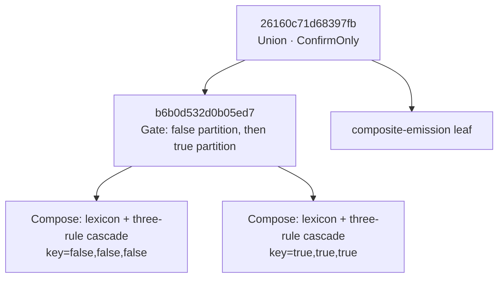
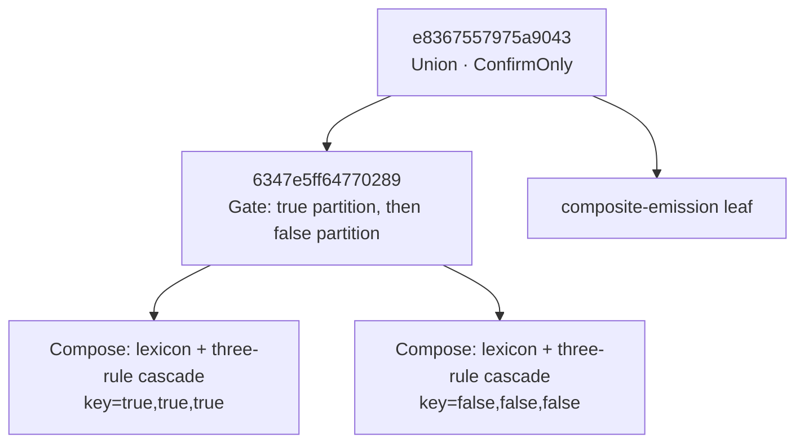

# Four promoted grammar recipe evidence (2026-07-28)

> **HISTORICAL (banner added 2026-07-30).** Two things have changed under this report. First,
> winner ranking no longer uses the wall-clock build/apply nanoseconds tabulated below: `2137168`
> and `0e9e08c` replaced the ranking key with deterministic work counters (HC confirmation steps),
> precisely because these wall-clock rankings picked different winners across repetitions. The
> Pareto tables remain valid as *measurements*; they no longer describe how a winner is chosen.
> Second, a naming caution: the "four grammars" here are the four **synthetic promoted plan-shape
> fixtures** (`recipe-*-generic`) — they are not the four language corpora (the parity effort's
> "four languages"), which are tracked in `docs/fst-plan/recipe-parity-plan-2026-07-30.md`.

This report records production `pangloss recipe-optimize` runs over the four language-neutral promoted fixtures. The portable integration gate is `rust/crates/pg-cli/tests/four_grammar_recipe_evidence.rs`; temporary output paths are not part of the contract.

## Reproduction

```text
cd rust
cargo test -p pg-foma --test recipe_promoted_fixtures
cargo test -p pg-foma --test recipe_optimizer_calibration -- --nocapture
cargo test -p pg-cli --test four_grammar_recipe_evidence
cargo test -p pg-cli --test recipe_optimize_timeout
```

The characterization run used seed 17, candidate/evaluation limits of 8, and a 5,000,000,000 ns hard elapsed limit. Timing values are nanoseconds. Environment: Windows NT 10.0.26200.0, Intel Core i7-12700, `rustc` and `cargo` 1.96.1, x86_64-pc-windows-msvc, debug profile. Runs were sequential.

## Four-grammar summary

Counts are `syntactic / attested / static / feasible`. Pilot timing columns are `materialize / capability / build / evaluation`. Pruning is `inapplicable / content-address duplicate / evaluated / fully confirmed`.

| Fixture | Counts | Pilot sample | p50 | p95 | Pruning | Strategy / termination | Result |
|---|---:|---:|---:|---:|---:|---|---|
| `recipe-gated-generic` | 7 / 7 / 3 / 3 exact | 3 | 14,600 / 59,800 / 22,400,700 / 3,354,300 | 15,300 / 60,600 / 23,969,800 / 3,390,300 | 4 / 0 / 3 / 3 | exhaustive / complete | all three candidates full-HC-confirmed over 9 words |
| `recipe-ordered-generic` | 7 / 7 / 2 / 2 exact | 2 | 4,000 / 71,200 / 25,708,400 / 1,637,400 | 12,900 / 98,100 / 26,321,600 / 1,865,600 | 2 / 3 / 2 / 0 | exhaustive / complete | no winner; every candidate has the same explicit multiplicity mismatch at `pur` |
| `recipe-strata-generic` | 7 / 7 / 2 / 2 exact | 2 | 10,000 / 83,000 / 31,682,000 / 4,142,000 | 28,300 / 98,000 / 31,982,500 / 4,254,400 | 4 / 1 / 2 / 0 | exhaustive / complete | no winner; every candidate has the same explicit multiplicity mismatch at `akutat` |
| `recipe-template-generic` | 7 / 7 / 1 / 1 exact | 1 | 4,300 / 81,200 / 584,500 / 235,300 | 4,300 / 81,200 / 584,500 / 235,300 | 0 / 3 / 1 / 1 | exhaustive / complete | sole candidate confirmed on deterministic `k` characterization observation; pruning is 0 inapplicable / 3 duplicates / 1 evaluated / 1 confirmed |

The template fixture also carries `RECIPE_ELIMINATION.md`: its baseline contains no permutable `Union`, so the complete-template materializer content-addresses to the default Plan. The promoted-fixture contract requires this elimination report while only one distinct Plan exists. Its bounded production characterization deterministically uses the first checked-in observation, `k` (`C(12,0) = 1`). The pathological `xxxxxxk` midpoint (`C(12,6) = 924`) and `xxxxxxxxxxxxk` endpoint remain mandatory in the promoted full-HC conformance oracle; they are not used to certify the one-word characterization winner. A direct optimizer run over all three words exceeded a 30,000,000,000 ns hard deadline before its first report checkpoint, while the bounded run completed with 13,696,900 ns accounted elapsed work. Thus `exact` describes the one-candidate recipe space, not full-corpus timing or arbitrary Plan-tree optimality.

## Detailed case study: gated MPR exception

This is the informative positive grammar because it produces three content-distinct, executable Plans and all three preserve HC analysis identity and multiplicity. The detailed run below is one production run with seed 17 and the limits above. Its content-address identities are stable; its nanosecond timings are observations, not constants.

### Baseline Plan

The baseline root is `26160c71d68397fb`. The diagram is a compact derived view of `baseline.plan.mmd`; shared rewrite leaves are collapsed into the `three-rule cascade` nodes.



### Selected Plan in the detailed run

The selected root is `e8367557975a9043`. It is the gate-permutation recipe: the two licensed partition groups are composed in the opposite order. The composite-emission branch and rewrite-rule leaves are unchanged.



`report.json` keeps the human recipe label separate from the content-addressed Plan-root ID. The integration test verifies that `baseline` and `winner` equal the roots in `baseline.plan.json` and `winner.plan.json`, and that the winner root occurs among the evaluated candidates.

### Pareto frontier and metric deltas

All rows are full-HC-confirmed over the same 9-word corpus. Structural size is tied at 27 states and 38 arcs; proposals and confirmation calls are tied at 9. Deltas are against the baseline. The Pareto frontier for this run contains the two alternatives.

| Plan root | Recipe | Frontier | Build ns | Δ build | Apply ns | Δ apply | Selection outcome |
|---|---|---:|---:|---:|---:|---:|---|
| `26160c71d68397fb` | baseline | no | 21,782,500 | 0 | 3,776,900 | 0 | retained safety baseline; dominated by the union permutation in this observation |
| `e8367557975a9043` | gate permutation | yes | 21,631,500 | −151,000 (−0.69%) | 3,810,700 | +33,800 (+0.89%) | selected by size-then-build lexicographic policy |
| `ef5a4c34718ebc23` | union permutation | yes | 21,698,700 | −83,800 (−0.38%) | 3,697,100 | −79,800 (−2.11%) | non-dominated, but its build was 67,200 ns slower than the selected Plan |

The gate permutation trades a slightly slower apply measurement for the lowest observed build measurement. The union permutation improves both measured build and apply relative to baseline, which eliminates baseline from this run's Pareto frontier. It remains a valid confirmed fallback, not a rejected grammar realization.

### Eliminated alternatives and pruning waterfall

The registry has seven recipe families, but applicability/materialization reduces them to three distinct feasible Plans for this grammar. In the detailed production report, the baseline plus three materialized registry instances account for four generated entries; one registry instance content-addresses to an already-seen Plan and is eliminated as a duplicate. No candidate is eliminated by capability, build, or HC: all three distinct Plans are evaluated and confirmed. Within ranking, baseline is Pareto-dominated in this observation; the union permutation remains Pareto-optimal but loses the deterministic lexicographic tie-break described above.

### Exact search, non-optimal timing conclusion

The search result is `quality=exact` only in the algorithmic sense: all three feasible, content-distinct candidates produced by registry schema 1 were evaluated within budget. It does **not** establish a universally optimal Plan over arbitrary compilation trees, and it does not establish a statistically stable fastest Plan.

Five immediate repetitions with the same grammar, seed, budget, and binary selected different roots:

| Repetition | Winner | Pareto frontier |
|---:|---|---|
| 1 | gate permutation `e836…` | `e836…`, `ef5…` |
| 2 | union permutation `ef5…` | `ef5…` |
| 3 | union permutation `ef5…` | `ef5…` |
| 4 | gate permutation `e836…` | baseline `2616…`, `e836…` |
| 5 | baseline `2616…` | baseline `2616…`, `ef5…` |

Thus the defensible conclusion is: the three Plans are structurally tied and fully conformant; a single run chooses the lexicographic winner for its measured values, but build/apply noise at sub-millisecond deltas changes the observed frontier and winner. Claiming one recipe as intrinsically optimal would require repeated measurements, uncertainty intervals, and a declared practical-equivalence threshold. Until then, the report proves exhaustive coverage of the registry-defined space and truthful deterministic ranking of one observation—not stable performance superiority.

## Negative and timeout evidence

The ordered and layered fixtures demonstrate the certification boundary: buildable candidates with real measurements remain ineligible when full HC finds a multiplicity mismatch. The template fixture separates bounded characterization from full-corpus certification: its deterministic boundary observation permits production measurement, while the promoted full-HC oracle still owns the 924-analysis midpoint. The separate deep template fixture demonstrates the hard process deadline: timeout produces an explicit non-certifying status and no false empty-result or winner claim. The adversarial `deletion-reduplication-exception-composite` fixture separately proves that every applicable distinct recipe preserves full-HC identity and multiplicity across deletion, full reduplication, and a lexical MPR exception.
