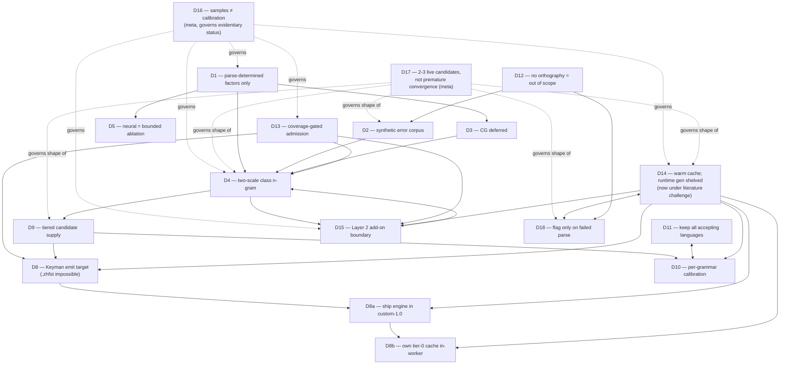

# Consistency register — mechanical internal-audit of `PLAN.md`

**Method note, read first.** `PLAN.md` was being actively edited by another process throughout
this audit: it grew from 1833 lines to 1881 to 2025 lines across the session (D2 was written out
in full where it had previously been a one-line table stub; D18 and a "Candidate ledger" section
were added; D14 grew a large new "THE 1% IS THE MOST LOAD-BEARING NUMBER" box). All line numbers
below are re-verified against the **final observed state, 2025 lines**, confirmed stable across
the last two full passes. Every citation in this register was re-`grep`ped against that state
immediately before being written down. If the file has grown further since, line numbers may have
drifted again — re-grep the quoted text before acting on any row.

Evidence tags: `[M]` = verified by reading a file in this repo in this session. `[S]` = my own
inference from `[M]` facts. No `[A]` claims are made in this register itself (findings quote or
verify PLAN.md and repo source directly).

---

## 1. Top 5 findings

### #1 — D16 declares D14 "untouched"; D14's own later text says that exemption "does not survive." BLOCKING.

- **Site A — `PLAN.md:1732-1735`** (D16, "What this does and does not invalidate"):
  > "It does **not** invalidate the design decisions D1-D15... **D14 in particular is untouched**:
  > the traffic model is a statement about how people type, corroborated independently by
  > query-autocompletion measurements, not derived from these grammars."
- **Site B — `PLAN.md:1416-1420`** (D14, the "⚠ THE 1% IS THE MOST LOAD-BEARING NUMBER" box, under
  "Disposition under D17"):
  > "it is now reclassified from a load-bearing premise to an **unvalidated placeholder pending
  > measurement**, and **D16's exemption of it (`PLAN.md:1618-1620`) does not survive**: the
  > exemption rested on query-autocompletion corroboration, and QAC's hyper-recurrent head is a
  > property of *web search traffic*, not of word-level typing in a polysynthetic language."
- **The conflict:** D16 asserts, as a currently-standing claim, that D14 is exempt from the
  provisional-narrowing rule because it doesn't lean on the four sample grammars. D14's own later
  text says that exemption "does not survive" — using the exact same evidentiary hook (QAC
  corroboration) D16 cites as its grounds. Both statements are live in the document at once; D16's
  text was never edited to reflect the retraction. This is the textbook case the task brief warned
  about: the amendment is written at D14 (the superseding decision) and not at D16 (the superseded
  claim), so a reader who stops at D16 — which explicitly bills itself as the rule that "governs
  every other entry in this table" (`PLAN.md:43`) — walks away believing D14 is evidentially clean.
  It is also, separately, the specific self-violation the audit brief asked me to hunt for: D16's
  own text is the site of a D16-rule violation.
- **Independent corroboration this is a real gap, not a stretch:** D14's design argument for
  choosing the "generate at build time" reading over the "corpus-observed only" reading
  (`PLAN.md:1457-1458`) explicitly leans on the four grammars' wordform counts — "Report 13's
  corpora are 6,973 wordforms (Sena 3), 673 (Amharic), 121 (Indonesian)" — which is exactly a
  D16-forbidden use (a sample number narrowing a design choice). D17 itself names this pattern
  generically (`PLAN.md:1786-1788`, quoting `REVIEW-LOG.md`'s P0-2) without tying it back to D16's
  specific "untouched" sentence.
- **Suggested resolution:** Edit D16:1732-1735 directly — strike "D14 in particular is untouched"
  and replace with a forward pointer to D14's own retraction, or remove the sentence entirely and
  let the "Provisional narrowings" table (`PLAN.md:1740-1750`) be the single source of truth for
  which decisions are and are not sample-tainted. As written, two authoritative-sounding claims
  about the same fact contradict each other and neither cross-references the other.

### #2 — D13's "this is not a new gate" cites an openspec change that has been renamed and philosophically reversed. BLOCKING.

- **Site A — `PLAN.md:1219-1222`** (D13, "This is not a new gate — it is an existing one"):
  > "`openspec/changes/certify-four-language-matrix/` already certifies a language **"only when
  > analysis-level corpus recall is complete."** That is exactly this precondition, already defined
  > and already measured, for Sena, Indonesian, Amharic, and Aweti. The speller declares it as an
  > admission criterion rather than inventing a parallel one."
  (Repeated at `PLAN.md:1275, 1288`.)
- **Site B — repo reality `[M]`:** `openspec/changes/certify-four-language-matrix/` does not exist.
  Commit `bf3d12c` ("docs: rename certify-four-language-matrix -> run-synthetic-conformance-matrix
  (Stage 4)", 2026-07-25 07:34:18 -0400 — **same day as, and hours before, D13 was decided**)
  renamed the directory and rewrote its `proposal.md`. The new text at
  `openspec/changes/run-synthetic-conformance-matrix/proposal.md:8-16` reads:
  > "there is no terminal certification stage and no external reference languages to certify
  > against... **Retire the "certify a language" framing: there are no external reference
  > languages to certify against.**"
  The exact phrase D13 quotes — "only when analysis-level corpus recall is complete" — no longer
  appears anywhere under `openspec/` `[M, grep confirmed]`.
- **The conflict:** D13's entire rhetorical move ("this is not a new gate, it's an existing one, so
  the speller isn't inventing a parallel admission criterion") depends on a spec artifact that, as
  of the morning of the same day D13 was written, had already been rewritten to explicitly disclaim
  the very "certify a language against fixed references" framing D13 leans on. D13's own later
  "Superseded" subsection (`PLAN.md:1277-1343`) acknowledges a rewrite is coming ("PanGloss is being
  completely rewritten to have a different certification criteria") but frames it as a future,
  externally-announced event ("John:") rather than recognizing that the specific openspec change it
  cited by path had *already* been retired in exactly that direction before D13's ink was dry. The
  citation is not merely stale — it points to an artifact that now argues the opposite of what it's
  quoted for.
- **Suggested resolution:** Update the citation to `openspec/changes/run-synthetic-conformance-matrix/`,
  and rewrite "this is not a new gate — it is an existing one" to acknowledge that the "existing
  gate" is itself gone: there is no longer a certification stage to point to, only a continuous
  conformance-integration-test posture. D13's actual admission criterion (coverage must be
  complete) needs to be restated as a plan-owned requirement, not inherited from an openspec change
  that no longer makes that requirement.

### #3 — D9's binary ranking rule and D10's entire calibration section read as current, unmarked, though D14 (written later) retires most of what they say. MISLEADING → BLOCKING for an implementer.

- **Site A — `PLAN.md:672-678`** (D9, "### The ranking rule", **no amendment marker anywhere in this
  subsection**):
  > "Unseen forms carry a **large fixed penalty** — a constant, not a learned weight — so a
  > grammar-generated form never outranks a form the user has typed... Hard-code the ordering and
  > let D4's terms rank *within* a tier."
  This is a strict two-population model (seen / unseen).
- **Site B — `PLAN.md:1520-1524`** (D14, item 2 of "What this opens"):
  > "**D9's binary rule needs a third rung.** 'Seen vs. unseen, large fixed penalty between them'
  > now has three populations: typed-by-this-user > shipped-warm-cache > generated-on-demand...
  > The large fixed penalty belongs between rungs 2 and 3."
  The tiers *table* just above D9's ranking-rule subsection does carry an amendment note
  ("**Amended 2026-07-25 by D14**," `PLAN.md:660-664`), but that note explicitly scopes itself to
  the table ("Read the table below as the tier *architecture*"), and the very next subsection — the
  ranking rule itself, the part D14 actually rewrites — carries no marker at all.
- **Compounding: D10's whole "Settled by the literature search" + "Open — this is the unbuilt part"**
  content (`PLAN.md:765-827`) is written, top to bottom, as live, still-needed design work — four
  numbered findings "adopted here" about tier-2 invocation policy, and an open-items list including
  "**The per-grammar, per-tier conditional performance profile** — what tiers 1 and 2 actually cost
  ... is the measurement to budget for" (`PLAN.md:816-819`). D14 (`PLAN.md:1543-1548`) later states:
  > "D10's calibration scope narrows sharply: with tiers 1-2 shelved at runtime, there is no tier-2
  > invocation threshold to calibrate and no anytime refinement to schedule. Report 11's 'tier-2
  > invocation must be a value-of-continuing estimate' finding **parks with tier 2** — correct,
  > unused, and the first thing to reread on un-shelving."
  Nothing in D10's own section (`PLAN.md:706-827`) points forward to this. An implementer who reads
  D9 and D10 in decision order (as the table lists them, before D14) and starts building the
  tier-1/2 runtime calibration harness D10 describes would be building the exact thing D14 shelves
  70 pages later, with no signal at the point of reading.
- **Suggested resolution:** Add a one-line amendment banner at the top of D9's "### The ranking
  rule" and at the top of D10's "### Settled by the literature search" / "### Open" subsections,
  each pointing to D14's "Consequences for D10 and report 11" and D14 item 2, the same way the
  tiers table already does.

### #4 — Two sample-derived design narrowings that D16's own "Provisional narrowings" table misses. MISLEADING.

D16's table (`PLAN.md:1740-1750`) is presented as an exhaustive catalogue ("every place a sample
was allowed to shrink the design"). Two clear instances are absent:

1. **D14's "cannot reach 10k" argument, `PLAN.md:1457-1458`:** "Report 13's corpora are 6,973
   wordforms (Sena 3), 673 (Amharic), 121 (Indonesian). Three of four grammars have nowhere near
   10k observed types." This sample-derived arithmetic is used to select between two competing
   readings of D14's own traffic model (favoring "cache is generated, not merely observed" over the
   plain-observation reading) — precisely a case of a sample number "narrowing a design" (D16 rule
   1, `PLAN.md:1716-1717`). Not in the table, and not caveated with a "PROVISIONAL" marker at its
   own site the way the D1 backoff-ladder passage is.
2. **Round-2 finding 4, `PLAN.md:1984-1988`:** "Raw word-edge phonology blows the state space
   (44² = 1,936 edge pairs for one grammar, 417² = 173,889 for another, against 15,804 and 184
   confirmed analyses) — test a *natural-class* edge factor or nothing." The 44/417 phoneme counts
   and the 15,804/184 confirmed-analysis counts are exactly the four-sample data D16 governs (Sena
   and Amharic specifically). The conclusion — ruling out one design (raw word-edge phonology) in
   favor of another (natural-class edge factor) — is stated as a flat finding ("Two clean
   negatives"), not flagged provisional, and appears in the document textually *after* D16/D17.
   Also absent from D16's table.
- **Suggested resolution:** Add both rows to the "Provisional narrowings" table, or add inline
  "PROVISIONAL" markers at their own sites the way D1's backoff-ladder passage does.

### #5 — `D8b`'s decision status is entirely absent from the plan's own decision-status table. MISLEADING.

- **Site A — `PLAN.md:25-44`** (the master "Decision | Status" table at the top of the file, the
  document's own index of what's decided): lists D1, D2, D3, D4, D5, D6, D7, D8, D8a, D9-D18 — 19
  rows. **`D8b` has no row.**
- **Site B — `PLAN.md:1125-1178`**: a fully-written subsection, `## D8b — We own the tier-0 cache
  in-worker; only *authored* words need a durable store`, opening "**Decided 2026-07-25** (John):
  ...", with its own consequences-for-D7 analysis and an open spike item.
- **The conflict:** the file's own framing sentence (`PLAN.md:3-4`) is "this file holds the
  *decided* parts of the spell-checking design," and the status table is the mechanism by which a
  reader is supposed to see the whole decided set at a glance. D8b is decided, in force (D14 and
  other sections cite it — e.g. `PLAN.md:1497` "D8b's `file:`-origin IndexedDB risk downgrades..."),
  and simply missing from the index.
- **Suggested resolution:** Add a `D8b` row to the table (it can share the general shape of the
  D8a row immediately above it).

---

## 2. The full contradiction register

| # | Type | Site A | Site B | Conflict | Severity | Suggested resolution |
|---|---|---|---|---|---|---|
| 1 | DIRECT CONTRADICTION / self-violation of D16 | `PLAN.md:1732-1735` | `PLAN.md:1416-1420` | D16 says "D14 in particular is untouched"; D14's own later text says that exact exemption "does not survive." | BLOCKING | Edit D16's sentence; point it at D14's retraction. |
| 2 | DANGLING DEPENDENCY | `PLAN.md:1219-1222, 1275, 1288` | `openspec/changes/run-synthetic-conformance-matrix/proposal.md:8-16` (renamed from `certify-four-language-matrix`, commit `bf3d12c`, 2026-07-25 07:34) | D13's "not a new gate, an existing one" cites a change that has been renamed and rewritten to explicitly retire the "certify a language" framing it's quoted for. | BLOCKING | Update path; rewrite the "existing gate" argument since the gate no longer exists in that form. |
| 3 | UNMARKED SUPERSESSION | `PLAN.md:672-678` (D9 "The ranking rule") | `PLAN.md:1520-1524` (D14 item 2) | D9's binary seen/unseen penalty rule is silently obsoleted by D14's three-population rule; no marker at D9's site. | MISLEADING–BLOCKING | Add amendment banner at D9's ranking-rule subsection. |
| 4 | UNMARKED SUPERSESSION | `PLAN.md:765-827` (D10, "Settled by literature search" + "Open") | `PLAN.md:1541-1548` (D14, "Consequences for D10 and report 11") | D10 reads as live, unbuilt, needed calibration work; D14 says this "narrows sharply" and one finding "parks... correct, unused." No forward pointer at D10. | MISLEADING–BLOCKING | Add amendment banner near the top of D10's post-report-11 content. |
| 5 | D16-SWEEP MISS | `PLAN.md:1457-1458` (D14) | `PLAN.md:1740-1750` (D16's "Provisional narrowings" table) | D14 uses four-sample wordform counts (6,973/673/121) to pick between two design readings; not listed as a narrowing, not marked provisional at its own site. | MISLEADING | Add a row to the table or an inline marker. |
| 6 | D16-SWEEP MISS | `PLAN.md:1984-1988` (round-2 finding 4) | `PLAN.md:1740-1750` | Sena/Amharic phoneme-pair and confirmed-analysis counts (44²/417²/15,804/184) used to declare a design conclusion ("test X or nothing") flatly, no provisional marker, not in the table. | MISLEADING | Same as above. |
| 7 | Structural omission | `PLAN.md:25-44` (status table) | `PLAN.md:1125-1178` (D8b) | D8b is a fully decided subsection with no row in the master decision table. | MISLEADING | Add a D8b row. |
| 8 | UNMARKED SUPERSESSION (minor) | `PLAN.md:1154-1159` (D8b, "Risk to spike before relying on this" — "This is the **one thing that would invalidate D8b**") | `PLAN.md:1497-1499` (D14 item 2) | D14 downgrades this risk from "the one thing that would invalidate D8b" to "the cache stops learning," but D8b's own text still calls it the invalidating risk. | COSMETIC–MISLEADING | Add forward pointer at D8b's own risk paragraph. |
| 9 | DANGLING DEPENDENCY (rotted internal cross-ref) | `PLAN.md:1837` (D18: `"D9:612-619"`) | Actual current content at `PLAN.md:612-619` is D3's CG-licensing discussion (GPL-3.0 vs. MIT), not D9 at all. D9's actual "tiers govern supply, never flagging" text is now at `PLAN.md:680-687`. | The document's own accretion (D2 was inserted whole between D1 and D3, shifting ~68 lines) rotted an internal line citation to point at unrelated content. | MISLEADING | Fix the citation to `D9:680-687`, or better, cite by section heading rather than absolute line, given this document's accretion rate. |
| 10 | DANGLING DEPENDENCY (rotted code citation) | `PLAN.md:936, 1064` (`rust/crates/pg-foma/src/composite.rs:525`) | Actual current location `[M]`: `rust/crates/pg-foma/src/composite.rs:566` (`// candidates_generated (confirm only prunes, never invents)`). | ~41-line drift; content still findable by search but the specific line cited no longer holds the quoted comment. | COSMETIC | Re-point citation to line 566, or drop the line number and cite the function/comment text. |
| 11 | DANGLING DEPENDENCY (forward reference to nonexistent report) | `PLAN.md:314` (D2: "report 22 is auditing whether the proposed grid search... is a valid procedure at all") | Repo state `[M]`: no `22-*.md` exists in `docs/research/spellcheck/` (only through `20-review-correction-and-candidates.md`, plus this file as `21-...`). | Citation to a report that has not been written yet; presumably a forward-reference to the next pass of an in-flight review campaign (consistent with `19`/`20` being "review" reports and `REVIEW-LOG.md` existing), but as written it is unresolvable today. | COSMETIC | Mark explicitly as "planned, not yet run" rather than citing it as an active authority. |
| 12 | PREMISE DRIFT (mild) | `PLAN.md:1214-1215` (D13: "the reference project's 760 human-approved analyses are not the blocker they first appear to be") | `PLAN.md:587-590` (D3's "MEASURED AND HALF-REFUTED" callout: only 147 of the 760 are token-anchored; the 760 are type-level) | D13 continues to reason about "760" as the relevant disambiguation resource in a passage about coverage/disambiguation, without the caveat (established elsewhere the same day) that 760 is a type-level count and the token-anchored figure is 147. The point D13 is making (type-level analyses exist) is still true, but a reader who has only read D13 will misjudge what "760" buys. | COSMETIC | Add a one-line pointer from D13's "760" mention to D3/D4's type-vs-token correction. |
| 13 | CIRCULAR DEPENDENCY (explicitly surfaced, not hidden — recorded here because the task asks for precision on it) | `PLAN.md:1859-1887` (D18) | `PLAN.md:1369-1432` (D14) | D18: correct flagging requires "an attempted parse that failed" at query time. D14: shelved runtime parsing to protect the latency budget. D18's own text: "D18 and D14 **cannot be fixed independently**." | Not a contradiction — the document names the cycle and resolves it by punting to an explicit product choice (Option A/B/C, `PLAN.md:1878-1887`), not by a build-time/query-time separation. Recorded as **not vicious**, but also **not yet resolved** — it is an open item disguised as a settled pair of decisions. | N/A (already handled correctly) | None needed beyond what D18 already does; flagged here only because the task explicitly asks for circular-dependency analysis. |

---

## 3. Decision dependency graph

**Prose reading.** D16 and D17 sit above the object-level decisions as meta-rules about evidence
and convergence; they don't add engineering constraints themselves, but they change how much
weight every other row is allowed to carry. Underneath that, D1 is the factor-vocabulary root that
D4, D5, and D3 all draw from directly. D4 is the structural center of gravity: D2 feeds its
error-cost term, D3's argument for *not* building CG routes cross-word regularity-learning back
into D4, D9's unseen-candidate ranking depends on D4's intra-word term being computable for
zero-count forms, and D13/D15 both size their concerns (ambiguity load, training bias) against D4's
lattice-marginalization design. D8 (Keyman) and D14 (warm cache) are the two big real-world-contact
decisions: D8 forces the engine-shipping shape (D8a/D8b), and D14 — originally framed as mostly
downstream of D8/D9's problems — has, as of the report-20 challenge documented in its own "⚠" box,
become the least secure node with the most fan-out: it touches D8's `p`-bound question, both D8a
and D8b's coordination items, D10's calibration scope, D15's pack-binding design, and D18's flagging
mechanism, and its own core number (the 90/9/1 traffic split) is explicitly under literature
challenge at the time of this audit.

**Load-bearing ranking (most to least, if the decision were overturned):**

1. **D4** — the single most load-bearing object-level decision. Losing it (e.g., if a neural
   reranker or a surface n-gram won the D5/round-2 comparisons) unwinds D2's estimation target, D9's
   ranking-within-tier mechanism, and the sizing arguments in D13/D14/D15.
2. **D14** — highest *current risk*, not just fan-out: the traffic-model number it rests on is
   actively challenged in-document (report 20), and D8/D8a/D8b/D10/D15/D18 all have text that
   explicitly changed shape because of it. If D14's 90/9/1 split is wrong, the "shelve runtime
   generation" architecture — and everything above that leaned on the resulting finite subtree
   (`p`-bound dissolution, D8b's downgrade, D10's narrowed scope) — reopens simultaneously.
3. **D1** — root of the factor vocabulary; D4, D5, D3 all cite it by name for what they may
   condition on.
4. **D8** — forces the entire integration shape (D8a, D8b) and the ownership split with Keyman;
   losing it (e.g., Keyman refuses `custom-1.0` cooperation) would require a different host or a
   different architecture entirely.
5. **D9** — the unseen/seen tiering that makes D4's intra-word term necessary in the first place;
   also the one D17 itself names as a "leading candidate" with **no live-alternative text anywhere**
   (see § 5).
6. **D16/D17** (meta) — governs interpretation of everything else; overturning them wouldn't change
   the object-level engineering, but would remove the "provisional" framing that currently limits
   how much weight numbers like Sena's coverage figures are allowed to carry.
7. **D13** — the coverage gate; already partially superseded in-document by the multi-FST rewrite
   note, so its "load" is already partly absorbed.
8. **D10, D2, D3, D15** — moderate; each has one or two clear downstream dependents but no wide
   fan-out.
9. **D11, D8a, D12, D18, D5, D8b** — narrowest blast radius if revisited individually.

**Decisions that are actually independent, and cheap to revisit:**

- **D12** (orthography-gated scope) — self-contained; its main interaction is a soft precondition
  for D2/D18 (an error implies a norm), not a load-bearing input any other decision computes from.
- **D11** (keep all accepting languages) — interacts with D10 only through a budget line
  ("summed over the resident set"); revisiting it doesn't touch D1-D9's substance.
- **D3** (CG deferred) — its dependency on other decisions is one-directional and thin (D1 narrows
  what CG rules may condition on); its own decisive argument is a licensing fact (GPL vs. MIT)
  that is completely external to the rest of the plan and would not move even if D1-D17 changed.
- **D8b** (in-worker cache mechanics) — narrow, mostly a verified-facts argument about IndexedDB in
  Web Workers; the one open risk (file: URI origin) is a cheap, isolated spike.

---

## 4. D16 compliance sweep

D16's own six rules (`PLAN.md:1716-1728`) forbid a sample number narrowing a design, setting a
default, fixing a threshold, or retiring a capability. Sweep results, one row per instance found,
beyond what D16's own "Provisional narrowings" table (`PLAN.md:1740-1750`) already lists:

| Number | Source | Design choice it's used to justify | Already in D16's table? | Legitimate under D16's own rules? |
|---|---|---|---|---|
| Sena/Amharic/Indonesian wordform counts 6,973 / 673 / 121 | Report 13 | D14's choice between "cache is generated" vs. "cache is corpus-observed" readings (`PLAN.md:1457-1458`) | **No** | **No** — this is exactly rule 1's forbidden move ("may never narrow a design... between candidate readings of a decision"), and it isn't flagged provisional at its own site. |
| 44² / 417² edge-pair state-space sizes, against 15,804/184 confirmed analyses | Report 13 + round-2 finding 4 | "test a *natural-class* edge factor or nothing" — ruling out raw word-edge phonology (`PLAN.md:1984-1988`) | **No** | **No** — stated as a flat "clean negative," not hedged; the underlying counts are four-sample data. |
| "D14 in particular is untouched" | D16 asserting D14 is *not* an instance of sample-driven narrowing | The exemption itself | N/A — this is D16 exempting a decision, not a narrowing | **No, and this is D16's own self-violation.** As shown in Finding #1, D14's design argument *does* lean on sample wordform counts (the 6,973/673/121 figure above), so D16's blanket exemption of D14 is itself false by D16's own later admission (`PLAN.md:1416-1420`). |
| Sena 760 `WfiAnalysis` records / 147 token-anchored | Report 13, corrected by report 18 | D13's framing of coverage vs. disambiguation risk (`PLAN.md:1214-1215`) | Partially — the ~147 figure is in the table (D4/round-2 row) but D13's own "760" restatement is not separately flagged | **Borderline** — the conclusion drawn (disambiguation isn't the blocker) likely survives regardless of 760 vs. 147, so this is closer to PREMISE DRIFT than a hard D16 violation, but it is an un-flagged restatement of a corrected number. |
| Coverage 24-85%, ambiguity 4.61/9/78, rung-cardinality, `mpr` emptiness | Report 13 | D1's backoff ladder, D13's admission bar, D15's training-bias argument | **Yes** — all covered in D16's table | Table's own dispositions ("PROVISIONAL," "RETAINED as hypothesis") are legitimate under D16's rules as written. |
| ~31.7k Sena word tokens | Report 18 | D15's corpus-size framing | **Yes** | Table's disposition ("NO... design for 10^5-10^6") is legitimate. |

**Net finding:** D16's table is not exhaustive. The two missed rows (wordform-count argument in
D14, phonology edge-pair argument in round 2) are genuine, unflagged instances of the exact pattern
D16 exists to police — and one of them is embedded in D16's own "untouched" claim about D14, which
is the clearest single instance of D16 committing the violation it was written to prevent.

---

## 5. D17 re-read: classifying all eighteen decisions

D17's own text (`PLAN.md:1805-1809`) already partially classifies six decisions by name (D7, D11,
D12, D13, D16, D17 as product/scope calls; D8 as architectural impossibility; D4, D9, D14 as
leading candidates). The table below extends that to every decision currently in the document
(through D18; D6/D7 are included for completeness even though the status table does not mark them
**DECIDED**, so D17's rule about "every DECIDED entry" only strictly binds the marked rows).

| Decision | Bucket | Justification |
|---|---|---|
| D1 | Architectural argument (impossibility-flavored) | The exclusion criterion ("deterministic function of the parse") is an architecture/schema argument (inherited from `grammar-json-export-plan.md`'s ratified ladder), not a data-pending empirical claim. Semantic domain is excluded by structure, not deferred pending measurement. |
| D2 | **Leading candidate** — and it is D17-compliant | Its own text says so explicitly (`PLAN.md:296-298`: "D2 is a **leading candidate**, not an architectural necessity") and carries a three-row live-candidate ledger (A/B/C) in place. Model case for the rest of the document. |
| D3 | Mixed: product/scope call (not on critical path) + architectural fact (GPL vs. MIT licensing is a hard external fact, not data-pending) | The "defer CG" call is John's scope decision; the reason a from-scratch engine costs 8-14 weeks is a licensing argument no corpus can change. |
| D4 | **Leading candidate**, per D17's own text | Explicitly D17's example. **Its own section carries no inline live-alternatives list** — see work item below; alternatives exist only scattered across Candidate-ledger rows C1/C2/C3/C7, with no pointer from D4 itself. |
| D5 | **Leading candidate**, and explicitly cited by D17 as the model shape | "D5 is upgraded, not weakened... D5 is the model, not the exception" (`PLAN.md:1810-1812`). Already carries a named alternative (CRF-first) and a measurable bar. Compliant. |
| D6 | Not yet decided | Table status is "required, undesigned" — outside D17's scope. |
| D7 | Product/scope call, per D17's own text | Privacy/governance posture; John's call. |
| D8 | Architectural impossibility, per D17's own text | The `.zhfst`-exactness argument is a proof from invariants (propose-confirm), not evidence-pending. |
| D8a | Mixed: architectural (no static lexicon format can express "confirm trims this" — a hard fact) + product/scope (accepting Keyman's key-adjacency is John's call) | The "must ship the engine" half is impossibility-flavored; the "accept Keyman's mechanisms" half is a scope call. |
| D8b | **Leading candidate**, currently unlabelled as such | Frames itself as "Decided," but explicitly names one open risk to spike (`file:`-origin IndexedDB) without stating what happens to the decision if the spike fails — no named fallback/alternative. See work item below. |
| D9 | **Leading candidate**, per D17's own text | **Has no live-alternative text anywhere in the document** — see work item below; this is the clearest gap of the three D17 names by name. |
| D10 | **Leading candidate** (a calibration *mechanism*, not a fixed policy, by its own description) | Its scope has been substantially narrowed by D14 (see Finding #3) without any restated alternative structure; what "the mechanism" now covers post-D14 is not explicitly re-stated as a candidate set. |
| D11 | Product/scope call, per D17's own text | "Prefer all languages" is explicitly John's framing choice, weighed against cost, not an empirical question. |
| D12 | Product/scope call, per D17's own text | Explicitly a scope/ethical call ("explicitly defer"), John's to make. |
| D13 | Product/scope call, per D17's own text (re-expressed as principle) | The *rule* ("ship only for languages meeting the bar") is a scope call; the *bar itself* is empirical and already partially retracted (§ Finding #2). |
| D14 | **Leading candidate**, per D17's own text — and now the best-instrumented example after D2 | Carries an explicit live-candidate row (C4 in the Candidate ledger) and its own in-place challenge box. Compliant, if belatedly. |
| D15 | Mixed: architectural (the pack-binding/versioning argument is a hard fact about `.pgpack`'s fingerprint hashing) + leading-candidate-flavored open question (what binds the add-on to the grammar) | The "not a pack payload" half is a settled architectural fact; the digest-binding proposal is explicitly an unresolved design, closer to a leading candidate without a ledger row. |
| D16 | Product/scope call, per D17's own text | Evidentiary-standard rule; John's call about how the plan may use data. |
| D17 | Product/scope call, per D17's own text (self-referential) | Same category, by its own admission. |
| D18 | **Leading candidate** — and the best example besides D2/D14 | Explicitly frames two live options (A: flag on completed parse, B: never flag) plus an eliminated one (C), and states plainly "this is John's call, and it is a product call" (`PLAN.md:1884-1887`). Also has a Candidate-ledger row (C6). Compliant. |

### Leading candidates with no named live alternative — the direct work item

Per D17's own rule ("The third class must carry its live alternatives," `PLAN.md:1809`), every
decision classified above as a leading candidate should carry live alternatives *at its own site*
(or an explicit, findable pointer to where they live). The ones that do not:

1. **D9** — classified by D17's own text as a leading candidate. No subsection, table, or ledger
   row anywhere in the document lists alternatives to the tiered-supply/strict-seen-priority
   design itself (the Candidate ledger's C4 is about *D14's* shelving choice, not D9's tiering
   architecture). This is the sharpest gap: one of the three decisions D17 names by name as needing
   live alternatives currently has none.
2. **D4** — alternatives exist, but only indirectly, scattered across Candidate-ledger rows
   C1 (lattice-training method), C2 (smoother), C3 (intra-word term), and C7 (inter-word unit) —
   none of which is referenced from D4's own section text. A reader entering at D4 (as the table
   lists it, second only to D1/D2/D3) has no way to discover that live alternatives exist elsewhere
   in the document.
3. **D8b** — decided in form, but its own text names an unresolved spike (file:-origin IndexedDB)
   without stating what the decision becomes if that spike fails. No alternative is named for that
   branch.
4. **D10** — post-D14, its remaining scope (what exactly is left to calibrate once tiers 1-2 are
   shelved) is not restated as a candidate set; D14 says the scope "narrows sharply" but does not
   say to what, precisely, and D10's own section (written before D14) still describes the old,
   wider scope.
5. **D15**'s binding-mechanism proposal (content digest over class-defining inventories) is offered
   as "the right binding" with no stated alternative or ledger row, despite being explicitly
   unresolved ("Whether Layer 1 should export such a digest is the only real Layer-1 ask... and it
   is small" — stated as settled, but nothing has actually decided to build it).

---

## 6. Sections checked and found clean

- **D1's core criterion and load-bearing-factor table** (`PLAN.md:54-132`) — internally consistent;
  the `mpr`/`≤6` correction is handled with an explicit strikethrough-and-correct pattern in place,
  which is the right way to do this and should be the model for the unmarked cases above.
- **D2's "Live candidates, per D17" structure** (`PLAN.md:296-309`) — a clean, fully D17-compliant
  example; no issues found.
- **D5's "what the research actually returned" / "why it is not the design" argument**
  (`PLAN.md:420-472`) — evidence and citations check out against reports 08/09 as described; no
  internal tension found.
- **D8/D8a/D8b's exactness-trap chain** (`PLAN.md:916-1178`) — the `.zhfst`-impossibility argument,
  the `traverseFromRoot` fork, and the ownership split are mutually consistent and each amendment
  (D8 → D8a → D8b) is explicitly and correctly marked as amending its predecessor. This is the
  pattern the D9/D10/D14 chain should have followed and didn't.
- **D11's hard-gate/soft-signal table and its interaction with D10** (`PLAN.md:831-913`) — the
  "never a silent drop" rule is stated once and consistently referenced elsewhere; no contradiction
  found.
- **D18's own internal structure** (`PLAN.md:1830-1888`, aside from the rotted `D9:612-619`
  citation already flagged) — the A/B/C option table and its explicit acknowledgment of the D14
  coupling is a clean, honest treatment of a genuinely open, unresolved product question. Recorded
  in the register as a circular dependency for completeness (row 13), not as a defect.
- **Code citations checked and confirmed accurate** `[M]`: `rust/crates/pg-parse/src/lib.rs:25-44`;
  `rust/crates/pg-grammar/src/model.rs:120-125` (content matches, though the "≤6 members" comment
  in the code itself is now factually stale per report 13 — a code-comment issue, not a PLAN.md
  issue); `rust/crates/pg-fwdata/src/extract/project.rs` and `extract/mod.rs`; `CONTEXT.md:47-48,
  195-196, 224`; `rust/crates/pg-pack/src/format.rs:146` and `manifest.rs:41-43`;
  `rust/crates/pg-parse/src/morpher.rs:137` and `:1103` (`resolve_morpheme`);
  `rust/crates/pg-fwdata/src/xml.rs:1-6`; `rust/crates/pg-cli/examples/spellcheck_measure.rs`
  (exists); `docs/grammar-json-export-plan.md:45, 48-50, 71`; `docs/fst-plan/foma-fst-plan.md:526-528`;
  `docs/fst-plan/synthetic-stress-grammar-plan.md:20-28`;
  `docs/fst-plan/morphotactic-composite-pruning.md:70-80`; `docs/fwdata-import-plan.md:78-84`;
  `rust/Cargo.toml:29` (MIT); `openspec/changes/calibrate-fst-resource-envelopes/` and
  `define-multilingual-spellcheck-runtime/` (both exist, and the `D-LangID-1`/`D-NGram-3`/
  `D-NGram-4` labels D11 cites resolve inside them).
- **Report 13's own internal arithmetic** (`13-first-measurements.md`) — cross-checked against
  every number PLAN.md quotes from it (coverage percentages, rung cardinalities, `mpr` figures,
  ambiguity distribution); all match.
- **00-synthesis.md's semantic-domain quote** (`00-synthesis.md:533-536`) that D1 claims to
  supersede — confirmed to say what D1 says it said, and D1's supersession of it is explicitly
  marked (unlike the D9/D10/D14 case). Correctly handled.
