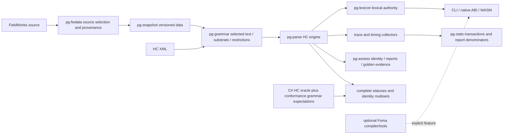

# Architecture and testing assurance review — 2026-09-30

Worktree: `.worktrees/architecture-assurance`, branch `review/architecture-assurance`.

Original review baseline PanGloss: `ac13fc17a5bef39c5419b97ea02886113b1178b4`. Final HC source checkpoint: `665b7d6b`, rebased onto integration base `5abf4842` (main including 0.5.1 release changes). Original hashes below identify historical pre-rebase checkpoints.

Historical pinned Machine control: `f412c252172d6589339d8f25ff6a7258ff33b432`. The requested force-pushed PR 480 head was `d8ff628dc53b3ba9c96cffc712cc5909fdfe961b`; the repaired and pushed current head is `18cf242f4b114b0eb9bac304b4b171ca2f499a39`.

Original user's Machine checkout: `34215889c7adf3012f700c9ee1c1d6712c056d15`, was clean internally and differed from the original superproject pin. The subsequent explicit request to update PR 480 authorized replacing this checkout; the actual main and review Machine checkouts now use `18cf242f`. The repaired gitlink is committed in the completed review; the final verification below precedes the authorized main integration and 0.5.2 CI release.

This is an architecture and evidence audit with focused corrections, not a certificate that every engine/API is interchangeable. Findings distinguish inspected source, demonstrated failing regression, corrected regression, and unavailable evidence. The optional whole-grammar Foma subsystem is a separate default-build requirement. HC's internal `pg-fst` remains required.

## Review organization

Four independent Sol/xhigh lanes: project/compiler architecture (`sol_project_architecture`); public execution/interfaces (`sol_execution_interfaces`); measurement/diagnostics (`sol_measurement_diagnostics`); test/oracle assurance (`review_strategy_challenge`).

Eight Luna lanes/sessions: selected-text/provenance (`review_scope`); Foma scope (`fst_default_scope`); measurements (`luna_stats_timing`); Foma implementation (`luna_foma_disconnect_impl`); artifact implementation (`luna_artifact_integrity_impl`); health research (`health-seams`); try-word research (`try-word-seams`); snapshot/pack research (`snapshot-pack-seams`). Native concurrency is four including primary; the final three read-only CLI sessions use skill-managed handoffs. The three CLI research sessions were unavailable because their local tool access stalled; verified owned stalled runners were terminated. A native read-only handoff covered the bounded health/pack fallback, and Sol plus primary inspection covered the execution-interface evidence. These failures remain unavailable sessions, never passing reviews. At most two Luna sessions receive Workspace write authorization concurrently, each in its own worktree. Primary reviews every diff and reruns authoritative checks.

## Owning seams



Selection and admission belong to compiler owners; interface adapters consume published results rather than reconstructing their decisions. Trace/stats instrumentation must preserve complete outcome identities and statuses. Report readers verify artifacts; report producers compute them. A missing measurement, cap, timeout, skipped case or missing fixture is not a passing rejection/equality claim.

## Findings and correction ledger

| ID | Priority | Owning seam / defect | Baseline evidence | Correction state |
|---|---|---|---|---|
| A01 | P1 | Environment-only literal completion omitted; restriction can disappear | Ignored target regression plus owner call graph | Restriction effect and negative controls pass in the compiler suite; final default suite recorded below |
| A02 | P1 | Native handle construction outside panic catcher aborts host | Missing/blank Language Name subprocesses aborted | Focused regressions pass; primary inspected complete panic boundary; final default suite recorded below |
| A03 | P1 | Conversion provenance validator unused by compiler | Programmatic schema 2/synthetic admitted; regression failed | Existing provenance validator called at compiler boundary; focused production/MeasureOnly regressions pass |
| A04 | P1 | Invalid/unresolved active environment and unsupported active phonological rules are dropped nonfatally | Existing tests explicitly require this; new production refusal regressions | Active restriction/rule refusal corrected; unreachable and discarded-sibling controls added; individual form recall policy kept separate |
| A05 | P1 | Untrusted duplicateCount expands report input without bound | Unbounded input expansion loop; zero/count-overflow and tampered-count regressions | Count aggregation corrected without expanding copies; delegated unit tests pass; final default suite recorded below |
| A06 | P1 | Oracle wrapper passes empty/truncated/all-skipped/inconsistent evidence | Seven of eight actual-owner regressions failed | Fixed; eight regression cases pass |
| A07 | P2 | Whole-fixture oracle waivers hide changed failures | Changed signature on known fixture accepted | Fixed: exact reviewed failure evidence required; forward marker alone insufficient |
| A08 | P2 | Cargo fallback stops after first failing target | Invocation regression failed across modes | Fixed; both runners aggregate failures by default |
| A09 | P2 | Assessment rootIndex wraps, duplicate JSON keys/digest corruption accepted | Source-supported; delegated regressions | Corrected in assessment owner; independent review found shape/unique-case gaps below; final default suite recorded below |
| A10 | P2 | Golden report omitted/duplicated/changed cases shrink denominator | Source-supported; delegated reconciliation regression | Full suite-to-report correspondence corrected; final default suite recorded below |
| A11 | P1 | Stats replacement leaves stale facts absent from new observation | Transaction upserts incoming keys but never deletes old keys | Transactional replacement corrected; all 50 stats unit tests pass, including empty replacement and rollback |
| A12 | P2 | CLI diagnostic counters mislabeled per word but cumulative | Snapshot collector contracts vs per-word emission | Owner resets and sequential CLI boundaries corrected; actual repeat-word failure changed expansion totals from 1/2 to 1/1; delegated check and scoped tests pass; final default suite recorded below |
| A13 | P2 | Stats exports omit invalid_shape; some filters ineffective; censor attribution denominator unclear | Sol source review; explicit all-cache denominator documented in original implementation | Corrected status export, censor/top filters and matched/displayed counts. Comparison elapsed is explicitly labeled; word filter narrows denominator, censor/top do not. Final default suite recorded below |
| A14 | P2 | Guess/timeout changes retain prior cached metrics for overlapping words | Source-supported; mixed-options allowed by existing spec | Fixed: owning-run options/counter semantics determine reuse; six executable runs on a verified backup of the original failing cache pass and preserve the unrelated word |
| A15 | P2 | Legacy ABI erases supplied-root payload and generation round trip | Source-supported sentinel/output reconstruction | Fixed: revision-bound rich runtime/native generation preserves full payload; numeric sentinels explicitly refuse; completion remains notAssessed |
| A16 | P2 | Native opts and ordinary API use different lexical authority | Unified runtime vs grammar-only Morpher call graph | Fixed in 014f2876: real add/override/remove × single/batch × guess matrix compares exact owner outcomes; valid-fixture baseline red reproduced |
| A17 | P2 | WASM analyzeText splits combining marks/supported punctuation | Tokenizer alphabetic/ASCII apostrophe only | Fixed in 665b7d6b: real generated bindings preserve NFC/NFD/punctuation/whitespace/text/cache identity; original bindings fail five final assertions |
| A18 | P2 | Plain CLI parse hides capped/invalid-shape completion | Actual invalid-shape and capped owner regressions failed | Fixed in 05c32532: plain/ordinary trace return failure with all completion flags; actual executable matrix passes |
| A19 | P2 | Reports identify invocation checkout instead of executable build | make-report git HEAD / stats version only | HC stats fixed: executable embeds its source revision and keeps it outside/inside other checkouts; Foma report provenance deferred |
| A20 | P2 | Optional Foma health evaluator accepts nominal phase with no measurements | Public evaluate API source-supported; actual worker has emit report | Needs to be done later: deliberately deferred optional Foma health contract |
| A22 | P1 | Duplicate report case IDs erase earlier comparison evidence | Independent Sol review plus conflicting-duplicate construction regression fails | Report construction owns uniqueness for all consumers; final default suite recorded below |
| A23 | P2 | Reader repairs missing nullable fields and ignores unknown keys before digest checks | Three reader/construction regressions fail among 26 report tests | Required types/nullable fields, unknown keys and outcome field guards implemented; final default suite recorded below |
| A21 | Coverage | Host tests do not execute JS/WASM transport smoke in required CI | Existing f4-wasm-smoke.js, host CI only | Required HC-only generated JS/WASM job added through a finite-memory managed service; actual CI proof pending main push |

## Evidence matrix and remaining acceptance work

| Behavior | Owner-level tests | Integration/differential evidence | Required remaining check |
|---|---|---|---|
| Core HC identities/statuses | Existing engine and conformance replay tests preserve multiplicity | Repaired 18cf242f C# oracle: upstream43/filtermirror9 pass; staged27 pass/two fail | Strict exit26 retained; shared zero-width issue #506 remains open |
| Auto-create phonology | Auto selection, inference/authored controls and actual environment restriction effect | Compiler-owned substrate report reaches CLI even with no warnings | A27 transport regressions and final integrated suite pass |
| Import provenance/admission | Existing direct validator tests; new actual compiler regressions | Referenced invalid restriction/rule refuses production; MeasureOnly remains explicit | Unreferenced invalid data must not cause spurious refusal |
| Stats/timing | Stats-on/off full outcomes, deterministic timing-stripped records, bounded attribution tests exist | Repeat word replacement, rollback and per-word reset effect; actual changed-option baseline | Fixed: owner-option reuse, atomic replacement and six-run executable replay pass |
| Try-a-word/trace | Trace+stats compare full outcomes/tree; rich trace publishes completion | Single/batch/native/WASM lexical authority and transport | Rich native identity/generation and opts owner matrix are corrected; legacy numeric supplied generation explicitly refuses |
| Health | Grammar warning identity/dedup and typed report validation | Default generic grammar-health command independent of optional compiler | Optional compiler health is not generic grammar health |
| Assessment | Stable identities/multisets, certification nonempty denominator gates | Strict artifact read and full golden case reconciliation | Corrupt/missing evidence must fail closed |
| Foma unplugging | Dependency-closure regression default vs explicit feature | Default native construction runs without compiler; ordinary all-target scope clean | Verify native and default-dev closures, explicit tooling check |

## Historical baseline verification

Managed `pg.ps1 -Mode check`: PASS; baseline all-target closure includes Foma and therefore violates the unplugging requirement.

C# source-pinned oracle built locally in isolated `machine` checkout (temporary sparse expansion to conformance/src/eng): build PASS, zero warnings/errors. Upstream control: 43 PASS / 0 FAIL / 0 SKIP, one pathological fixture excluded. Filter mirror: 9 PASS / 0 FAIL / 0 SKIP. Staged: 29 attempted, 27 PASS, two known fixture failures; one pathological fixture excluded.

The zero-width forward-synthesis fixture produces changing erroneous identity multisets across runs. The old marker-based waiver accepted all variants. The corrected exact-evidence gate detected a changed failure and exited 26. This is unresolved oracle evidence, not a newly proven Rust regression. Never broaden the waiver merely to obtain green. See `docs/divergences` and the fixture's existing provenance/derivation for the semantic concern. No upstream messages/issues were posted by this review.

Detailed command transcripts are retained locally under ignored `.tmp/review/`; command scope and outcomes are summarized below. These logs are local evidence, not committed build artifacts.

## Historical oracle artifact provenance

The isolated pinned checkout built the source oracle at `f412c252172d6589339d8f25ff6a7258ff33b432` without tracked Machine modifications. Oracle executable SHA-256: `0961477b2acd07792fbee2e6a64c22447d16490b24f818133a599c9e9b220f9b`.

Strict verification command (both controls use that executable):

```powershell
pwsh -NoProfile -File rust/tools/oracle-conformance.ps1 -Scope all -ExePath machine/src/SIL.Machine.Morphology.HermitCrab.Conformance/bin/Release/net10.0/hc-conformance.exe -PinExePath machine/src/SIL.Machine.Morphology.HermitCrab.Conformance/bin/Release/net10.0/hc-conformance.exe
```

Outcome: exit 26; staged 27 PASS / one exact known failure / one changed detailed failure; upstream 43 PASS; mirrored filter-pass subset 9 PASS. Pathological exclusions are printed and reconciled against discovery; zero executed assertions cannot pass the wrapper.

## Historical force-pushed Machine PR 480 checkpoint

The explicitly requested force-push update fetched `refs/pull/480/head` and checked out `d8ff628dc53b3ba9c96cffc712cc5909fdfe961b` in the main and review Machine submodules, after verifying both were clean. Local backup refs retain the earlier revisions. No tracked Machine source was changed.

The updated checkout's required `./local_check.sh --agent-strict` exits 1 during its Release build. It reports one warning and one error: `PhaseTraceRecorder.cs:26` fails CS0535 because its three-argument `EndUnapplyTemplate` implementation does not implement `ITraceManager.EndUnapplyTemplate(AffixTemplate, Word, bool, FailureReason)`. The strict script stops before Machine tests, semantic coverage, fixture self-check and parity check. Formatting output says “Checked 0 files”; this is not evidence of a successful whole-tree formatting scan.

Fresh C# differential evidence for this revision is unavailable. The prior executable/hash/counts above belong to the historical `f412c252` revision and are not reused as evidence for the new head. The Machine pointer is updated despite the upstream build defect; this review does not silently modify PR 480 or broaden oracle waivers.

## Additional review findings

| ID | Priority | Owner / demonstrated issue | Result |
|---|---|---|---|
| A24 | P1 | Managed native argument transport split a filter expression and lost argv boundaries; actual subprocess received 8 arguments instead of 4 | Windows quoting fixed at `Invoke-ManagedProcess`; actual value/count regression passes, including empty values, quotes and trailing backslashes |
| A25 | P2 | Schema test helper skipped integer bounds above signed i64, and published report schema permitted absent or conflicting outcome evidence | i128 integer comparison and outcome-specific oneOf/boolean schemas added. Independent review corrected a wrong-case test fixture; final default schema suite recorded below |
| A26 | P1 / upstream | New Machine PR 480 head cannot compile its conformance oracle | CS0535 reproduced by required strict check | Fixed and pushed upstream 18cf242f; descendant PanGloss gitlink committed; fresh oracle evidence below |
| A27 | P2 | Successful auto-create substrate report discarded at CLI loader | Actual inferred-segment and warning-free boundary transport regressions failed | Fixed in 05c32532 through additive compiler full-output owner; both executable transport controls pass |

## Default Foma disconnection

The ordinary workspace, launcher and CI use published `default-members`. `pg-foma`, `pg-foma-runtime`, `pg-foma-backend` and the native `foma` dependency are absent from the default dependency closure, including generic test dependencies. CLI/native construction uses the HC runtime. `pg-fst` remains because HC's own rule engine requires it. Generic grammar-health, statistics, assessment, pack-integrity and FFI recovery coverage remain in the default suite.

Whole-grammar Foma source stays available through explicit opt-in: `pg.ps1 -Mode check -Package pg-cli` with `PANGLOSS_EXTRA_ARGS='--features foma-tools'`, or the corresponding `pg-ffi`, `pg-assess` and `pg-pack` packages. `--workspace` explicitly selects the experimental members. No FST thresholds, refusals, retry or containment controls were changed.

## Regression witnesses and policy boundaries

Compiler regressions live in `rust/crates/pg-grammar/src/compile/tests.rs`: `environment_only_undeclared_exemplar_is_completed_from_usage` asserts the restriction's actual HC effect, not merely an inferred-segment count; `unsupported_provenance_never_claims_clean_conversion` exercises the published provenance owner; `unreferenced_invalid_environment_does_not_refuse_production`, `unreachable_affix_environment_is_nonfatal_and_root_positions_are_not_inferred`, and `discarded_affix_environment_does_not_refuse_a_surviving_sibling` guard the negative direction. Initial compiler evidence was 191 PASS / 6 FAIL / 9 SKIP; after owner corrections and the independently discovered discarded-sibling regression, its final quick run was 200 PASS / 0 FAIL / 9 SKIP.

`rust/crates/pg-fwdata/tests/compile_real_projects_gate.rs` keeps Sena's original nine form ambiguities and zero unresolved-use ceilings. It pins three newly measured selected PhEnvironment witnesses separately, including exact normalized source expressions containing `~`; checks typed EnvironmentInvalid issues, absence of an inferred `~`, and the production owner's fatal refusal. It does not admit Sena for production or infer an unsupported punctuation character to satisfy a measurement ratchet. Amharic retains its zero-ambiguity requirement. This separates improved measurement from production admission.

`rust/crates/pg-stats/src/cache/tests.rs::replacing_word_replaces_all_facts_and_failure_rolls_back` demonstrates the stale-fact defect, replacement by an empty fact set, and transactional rollback. Diagnostic tests execute a repeat word in a child process with its own environment; parent-process environment is never mutated. This matters because a fresh thread alone does not isolate process-global environment from concurrent tests.

Default graph evidence is `rust/crates/pg-cli/tests/default_dependency_closure.rs`; it inspects the actual default-member dependency closure, including dev edges, and requires HC's `pg-fst`. FFI construction regressions in `rust/crates/pg-ffi/tests/grammar_load_panic_boundary.rs` require a null handle plus a returned, freed error buffer. Existing mutation/pool recovery tests remain default and assert rebuild effects. Generic pack integrity tests remain default; only actual Foma round trips opt in. New cases are imported into existing consolidated harnesses rather than creating extra test targets.

The native and WASM shared binding fixture preserves exact normalized identities, multiplicities and completion statuses. Its default HC grammar's `candidatesGenerated` is 1; the optional Foma path's explicitly named telemetry expectation is 2. This single backend work counter differs; no analysis identity or completion-status expectation was weakened.

Assessment reader/construction fixes reject duplicate keys, digest corruption, duplicate case IDs, invalid counts/root indexes, missing required nullable fields, unknown fields and evidence that conflicts with an outcome. Golden comparison requires full case/input correspondence. The published schema's outcome guards and unsigned integer bounds have dedicated negative controls. The runtime reader is not a complete general JSON Schema evaluator; this review does not certify every schema string/counter bound.

## Remaining contracts to settle

At the original audit checkpoint, A14–A20 and the required-CI part of A21 were source-supported follow-up work. The authorized HC follow-up and its current evidence are recorded below; optional Foma work remains deferred. The final HC entries below close those specific API/cache gaps with owner calls and discriminating regressions, including full statuses and identity multiplicity.

Individual unsegmentable allomorph handling remains the existing nonfatal recall policy. The accepted policy and a later gap plan differ in their intended direction; this review does not replace that policy by an incidental restriction fix. At the original checkpoint, successful auto-inference was dropped from the CLI wrapper when no warnings existed. The authorized follow-up fixes this at the compiler-owned output seam (A27 below).

Featureless inferred/authored comparisons demonstrate each engine's local inference semantics. They do not establish HC/Foma equivalence. Missing private corpora and pathological exclusions remain outside the demonstrated denominator. The repaired PR 480 source now builds the founding oracle. Its fresh strict run retains the changing zero-width failure and exact-evidence exit26; shared Machine issue #506 remains open.

## Original audit authoritative verification

All Rust invocations below use a fresh `pwsh -NoProfile` and `rust/tools/pg.ps1`; no bare Cargo compile/test bypass was used. The final pair of managed builds ran with about 24.8 GiB free physical memory and the repository's two-build-slot limit. Formatting, comment hygiene and clippy with `-D warnings` run before compilation/execution.

| Scope and exact entry point | Outcome | Local transcript |
|---|---|---|
| Default `pwsh -NoProfile -File rust/tools/pg.ps1 -Mode test` with complete failure aggregation | 1615 PASS / 0 FAIL / 64 SKIP; exit 0. Subsequent test-only admission assertion is checked separately below | `.tmp/review/final-default-tests.log` |
| `pg.ps1 -Mode test -Package pg-fwdata -TestTarget all -Filter compile_real_projects_gate` | 4 PASS / 0 FAIL; 54 outside selected scope; strengthened admission witness included | `.tmp/review/sena-admission-final.log` |
| `pg.ps1 -Mode check` before each commit | PASS, default all-target CI-equivalent lint/hygiene/format scope | `.tmp/review/pre-*-commit-check.log` |
| `pwsh -NoProfile -File rust/tools/tests/run-all.ps1` | 29 test files PASS, 0 failed; includes eight oracle evidence cases and native argv effect tests | `.tmp/review/launcher-final-green.log` |
| `pg.ps1 -Mode check -Package <package>` with `PANGLOSS_EXTRA_ARGS='--features foma-tools'`, separately for pg-cli, pg-ffi, pg-assess, pg-pack | All four optional all-target feature checks PASS; this is compilation/lint, not complete optional runtime execution | `.tmp/review/optional-pg-*-check.log` |
| `pg.ps1 -Mode build -Package pg-wasm -DebugProfile` with `PANGLOSS_EXTRA_ARGS='--target wasm32-unknown-unknown'` | PASS at final source | `.tmp/review/wasm-tip-target.log` |
| Generated nodejs binding via wasm-bindgen 0.2.126, then `node tools/f4-wasm-smoke.js` from rust/ | 3 PASS / 0 FAIL / 2 SKIP; exact shared transcript, stale cache after gloss edit, authored-case cache identity. Indonesian/Sena sample corpora absent | `.tmp/review/wasm-tip-smoke.log` |
| Updated Machine `./local_check.sh --agent-strict` | FAIL during build, CS0535; fresh oracle unavailable | `.tmp/review/machine-pr480-strict.log` |
| Historical pinned `oracle-conformance.ps1 -Scope all` with explicit ExePath and PinExePath | Exit 26; complete evidence and changed mismatch detected, not green | `.tmp/review/strict-oracle-all.log` |

WASM binary and generated binding are retained only under ignored `.tmp/review/wasm-pkg`; generated assets are not source changes. The full default Rust denominator is distinct from founding-oracle equivalence and private-corpus coverage.

The final full Rust run completed all 1,615 executions with failure aggregation enabled. Afterward the Sena regression's test-only refusal assertion was strengthened to require fatal EnvironmentInvalid evidence from the exact typed witness set; the focused real-project run passed all four selected tests, and managed check passed separately. No production code changed after the full run or the final WASM build.

Historical source anchors for the then-open contracts: A14 is `pg-cli/src/stats_cmd.rs` cache option identities and reuse; A15/A16 are `pg-ffi/src/buffer.rs` serialization and `pg-ffi/src/parse.rs` grammar-only opts versus unified ordinary calls; A17 is `pg-wasm/src/lib.rs::tokenize`'s character predicate; A18 is plain CLI parse output versus the rich trace surface; A19 is `pg-cli/src/make_report.rs::repo_head_revision`'s invocation git query; A20 is `pg-health/src/health.rs` missing-measurement defaults. These paths are relative to `rust/crates/`.

All four Sol lanes provided bounded source/diff reviews; follow-up review found the discarded-sibling, global-environment-test race, wrong-case schema fixture, and unrelated-fatal-test masking issues before handback. These corrections and the full suite are independent evidence; a bounded GO does not certify unrelated backlog contracts.


## Authorized HC follow-up: repaired Machine PR 480

The follow-up plan is `docs/superpowers/plans/2026-09-30-hc-review-follow-up.md`. The user authorized a new upstream commit and the remaining HC fixes, while explicitly deferring Foma/FST work.

Machine PR 480 now points to `18cf242f4b114b0eb9bac304b4b171ca2f499a39`, an ordinary descendant commit of `d8ff628d`, pushed to `integrate-conformance-framework` and verified against both the remote ref and GitHub PR head. The two-file fix restores the recorder's four-argument ITraceManager contract and retains the template failure reason. The focused recorder suite passes 8/8; the full Release build succeeds and .NET tests report 1,574 PASS / 0 FAIL / 4 SKIP across 1,578 attempted executions. The strict script remains FAIL at its later semantic catalog authority gate: 264 mappings are unclassified in the unchanged bootstrap catalog (108 unclassified features, empty auditedSourceScopes). No classifications or waivers were invented. Its trailing checks were run separately: oracle fixture self-check 43 PASS / 0 FAIL / 0 SKIP, Python parity PASS (30/30 in-scope constructs).

PanGloss's root and three review Machine checkouts were updated only after checking their worktrees were clean. The committed review gitlink pins the verified upstream SHA.

Fresh strict C# oracle evidence uses the repaired isolated checkout's Release `hc-conformance.exe`, with both ExePath and PinExePath explicitly supplied. Artifact SHA-256: `6e6cc41247a8f6a8f487bc82cbfc8167d6717f0879d3d6a2e348cf81e5f056e4`. Staged: 29 attempted, 27 PASS, one exact known head-ambiguous rule-attribution failure, one changed zero-width identity failure; upstream: 43/43 PASS; filter-pass mirror: 9/9 PASS. Overall exit 26 remains correct. The zero-width issue already has Machine issue #506 and the divergence evidence in `docs/divergences/036-zero-width-morpheme-identity.md`; this is not grounds to enlarge a waiver or claim new founding-oracle parity. Historical evidence above remains labeled separately.

A26's interface/build defect is fixed. The intentional semantic catalog classification backlog and existing shared-oracle issue remain visible as independent limitations. At this historical Machine-repair checkpoint, A14-A19/A21 and substrate propagation were still being implemented. The final HC verification below supersedes that status. Needs to be done later: A20 Foma health, Foma-only make-report provenance, explicit --workspace Foma coverage scope, and all Foma/FST mechanisms. This follow-up changes none of them.


Primary HC follow-up checkpoint (`05c32532`): A18 is fixed with unchanged complete-result stdout, explicit incomplete flags/failure exit for plain and ordinary trace, additive HC step-cap/timeout flags, and actual subprocess hit/rejection/invalid/cap/timeout controls. Successful substrate report propagation is fixed through the compiler's additive full-output/import-warnings owner API and CLI loader; inferred segment positive and authored controls plus warning-free inferred boundary transport checks pass. This is additional finding A27 (P2): successful auto-create phonology evidence had been discarded at the CLI tuple-returning loader seam. The compiler's selection/admission decisions and default budgets are unchanged. Independent Sol review found no blocker; its nonempty-analysis test strengthening was applied and rerun. Managed pg-cli all-target check, two completion owner regressions, two real inference transport regressions, and the completion subprocess matrix pass. The isolated PowerShell aggregator reports 29 files PASS / 0 FAIL.

The pushed Machine `18cf242f` head's Linux and Windows build checks, both conformance jobs, comment-hygiene jobs, and NuGet package job are now SUCCESS (verified GitHub check rollup and remote branch SHA). This CI evidence does not turn the separately executed full strict catalog-authority failure into a pass. A14 actual executable baseline is independently measured: initial `gag,kad` stats batch without guessing analyzed two words; overlapping `gag` with guessing enabled produced a current parse but stats reported analyzed=0 / skipped=1 and retained its earlier metrics. The completed replay below uses an integrity-checked SQLite backup of this unchanged original cache.


A15 runtime-owner checkpoint: the previous generation caller accepted a forged supplied lexical spelling and returned ["panu"]. The additive revision-bound runtime API now validates against the same immutable canonical-root snapshot used by the import/overlay owner. Eight actual owner regressions pass: full structured serialization and root-plus-affix homographs, eight forged payload fields, stale/removed/inactive/superseded identities, active overrides, aligned sentinel/head/provenance checks, authored controls, and grammar-head/supplied-nonhead compounds. Parse projection and generation validation share the extracted SuppliedRoot provenance fact. Independent Sol review reports GO for owner and native adapter with the completion limitation below.

Generation completion limitation: existing synthesis caps are enforced by independent local counters without publishing their stop outcomes. The rich API reports completion="notAssessed" explicitly; it does not claim an empty or partial generation result is complete. Instrumenting and aggregating those owner stop outcomes needs separate engine work. This pass does not change synthesis counting or budgets.

Native HC integration checkpoint (`4edee38d`): two actual ABI baseline regressions fail because the JSON projection omits synthesis fields and legacy sentinel generation returns HC_OK. Both now pass. The full native consolidated harness reports 21 PASS / 0 FAIL / three private-corpus SKIP, including independent full WordAnalysis owner comparisons, supplied homographs plus affixes, forged/stale/removed/guessed/unknown requests, authored numeric controls, exact shared-plus-native fixture reconciliation, and actual C/C++ header compile/link/run. Explicit managed pg-ffi all-target check passes and the temporary diagnostic output was removed.

Reporting integration checkpoint (`dbde3529`, delegated `96affa66`): per-word owning-run option/counter reuse, shared options hashing and embedded executable revision are integrated. Focused stats unit tests 51/51, CLI option-ownership test 1/1 and actual foreign-checkout/non-checkout child provenance test 1/1 pass. The mandatory HC-only WASM job enters the reviewed finite 6G systemd service before managed Rust work. Independent Sol review is GO; the Linux launch is source/contract-tested locally, with actual hosted execution pending main CI.

The user additionally authorizes merging the finished review onto main, pushing and releasing 0.5.2 after verification. Remote main at that checkpoint was 5abf4842 and included the 0.5.1 multiplatform release workflow; the completed rebase preserves those changes. At this historical pre-integration checkpoint, no review changes had been merged or released.


## Final HC verification before main integration

Primary personally inspected every delegated source diff and the final canonical override fixture.
Independent Sol review is GO for the integrated source at `665b7d6b`, including A16/A17, the release
notes, default Foma separation and preserved current-main release workflow. `git range-diff` maps
all 15 pre-rebase commits to the integrated history; 14 replay identically. The manifest conflict
was solely main's committed CRLF framing and 0.5.1 stamp: normalized content is exactly the old
review manifest with version 0.5.0 replaced by 0.5.1. No reviewed source change was lost.

| Final local check | Result |
|---|---|
| Managed default all-target check | PASS; formatting, comment hygiene and clippy warnings denied |
| Managed full default suite, failure aggregation | 1,641 attempted / 1,641 PASS / 0 FAIL / 64 explicit SKIP; scope all |
| Actual native C/C++ header compile/link/run | PASS within the full suite; full native harness 22 PASS / 0 FAIL / 3 private-corpus SKIP |
| Managed default rustdoc, private items and warnings denied | PASS |
| Actual wasm32 managed build, generated default Node package and API check | PASS |
| Generated JavaScript/WASM assertions | 10 PASS / 0 FAIL / 2 private-corpus SKIP |
| Complete isolated PowerShell aggregator | 29 files PASS / 0 FAIL |
| Original-cache executable replay | All six owner/options/reuse assertions PASS; original evidence unchanged |

The final valid native fixture was also run against the original `5abf4842` parse implementation:
it failed at supplied `ga`, whose opts result was empty while the direct owner returned its supplied
root. Restoring the reviewed implementation makes the same test pass in the full suite. The final
WASM regression against archived original bindings produces five FAIL with its five compatibility
controls still PASS; the regenerated final bindings pass all ten. These are real transport failures,
not invalid test-setup failures or missing-package failures.

A14 replay uses the executable built at `7d49ca81` and an integrity-checked SQLite backup with exact
initial run/word rows. Guess-on recomputes the overlapping `gag` (1 analyzed), unchanged guess-on
reuses it (0), guess-off recomputes (1), adding a timeout recomputes (1), changing it recomputes (1),
and unchanged timeout reuses (0). `kad` stays owned by its original run in every case; the original
cache retains both words under run 1 and exactly two historical runs. Persisted build identity is
`pangloss/0.5.1+7d49ca81...`. The later interface changes do not change this stats policy; the final
suite independently repeats option ownership and foreign-checkout executable provenance tests.

Local transcripts are retained under `.tmp/review/hc-final-*`, `native-authority-valid-fixture-red.log`,
`wasm-orthography-integrated-baseline-red.log`, and `a14-preserved-cache-{before,fixed}.json`.
Historical transcripts/counts above are kept separate. The required hosted Linux WASM job and
release gates must still prove their actual CI effects at the pushed main tip before publishing.

Needs to be done later: A20 Foma health missing-measurement handling, Foma report provenance,
explicit workspace coverage's Foma scope, and optional Foma/FST architecture, readiness,
threshold/refusal/retry/containment/admission work. Generation completion remains `notAssessed`.
The repaired-source strict C# evidence remains exit 26 with its known attribution failure and changed
zero-width identity failure; the upstream catalog classification backlog also remains visible.
No waiver or generation completeness claim was added to obtain a passing result.


## Hosted integration checkpoint

Main was fast-forwarded and pushed at `ba055fe7`. Its Rust CI run
[36800899745](https://github.com/sillsdev/PanGloss/actions/runs/36800899745)
passed formatting, clippy, the default build/test job and the actual Linux containment proof.
The new required WASM job failed before Cargo: its supervisor leaf had no `memory.max`,
because that child had omitted the memory-controller setup already owned by the containment child.

The repair extracts that existing setup into one shared Bash helper called by both children.
It preserves exact supervisor membership, empty unit root, controller availability,
`+memory` enable/readback and the finite positive parent cap, and explicitly checks the
supervisor's readable `memory.max` before managed tools run. A leaf value of `max` remains
valid under the finite 6 GiB parent. The adapter preflight and cap are unchanged.
The per-child contract regression fails on the previous script and passes 12/12 after repair;
Bash syntax and the delegated managed package check also pass. Actual hosted execution at
the repaired main tip remains the acceptance condition; source checks alone do not certify it.
This is launcher setup for HC WASM, with optional Foma/FST engine work still deferred.
