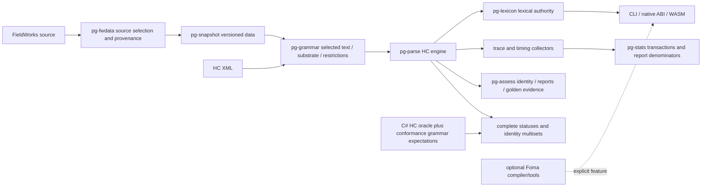

# Architecture and testing assurance review — 2026-09-30

Worktree: `.worktrees/architecture-assurance`, branch `review/architecture-assurance`.

Baseline PanGloss: `ac13fc17a5bef39c5419b97ea02886113b1178b4`.

Historical pinned Machine control: `f412c252172d6589339d8f25ff6a7258ff33b432`. Current user-requested PR 480 head: `d8ff628dc53b3ba9c96cffc712cc5909fdfe961b`.

Original user's Machine checkout: `34215889c7adf3012f700c9ee1c1d6712c056d15`, was clean internally and differed from the original superproject pin. The subsequent explicit request to update PR 480 authorized replacing this checkout; both main and the review worktree now use `d8ff628d`.

This is an architecture and evidence audit with focused corrections, not a certificate that every engine/API is interchangeable. Findings distinguish inspected source, demonstrated failing regression, corrected regression, and unavailable evidence. The optional whole-grammar Foma subsystem is a separate default-build requirement. HC's internal `pg-fst` remains required.

## Review organization

Four independent Sol/xhigh lanes: project/compiler architecture (`sol_project_architecture`); public execution/interfaces (`sol_execution_interfaces`); measurement/diagnostics (`sol_measurement_diagnostics`); test/oracle assurance (`review_strategy_challenge`).

Eight Luna lanes/sessions: selected-text/provenance (`review_scope`); Foma scope (`fst_default_scope`); measurements (`luna_stats_timing`); Foma implementation (`luna_foma_disconnect_impl`); artifact implementation (`luna_artifact_integrity_impl`); health research (`health-seams`); try-word research (`try-word-seams`); snapshot/pack research (`snapshot-pack-seams`). Native concurrency is four including primary; the final three read-only CLI sessions use skill-managed handoffs. The three CLI research sessions were unavailable because their local tool access stalled; verified owned stalled runners were terminated. A native read-only handoff covered the bounded health/pack fallback, and Sol plus primary inspection covered the execution-interface evidence. These failures remain unavailable sessions, never passing reviews. At most two Luna sessions receive Workspace write authorization concurrently, each in its own worktree. Primary reviews every diff and reruns authoritative checks.

## Owning seams



Selection and admission belong to compiler owners; interface adapters consume published results rather than reconstructing their decisions. Trace/stats instrumentation must preserve complete outcome identities and statuses. Report readers verify artifacts; report producers compute them. A missing measurement, cap, timeout, skipped case or missing fixture is not a passing rejection/equality claim.

## Findings and correction ledger

| ID | Priority | Owning seam / defect | Baseline evidence | Correction state |
|---|---|---|---|---|
| A01 | P1 | Environment-only literal completion omitted; restriction can disappear | Ignored target regression plus owner call graph | Restriction effect and negative controls pass in the compiler suite; final default suite recorded below |
| A02 | P1 | Native handle construction outside panic catcher aborts host | Missing/blank Language Name subprocesses aborted | Focused regressions pass; primary inspected complete panic boundary; final default suite recorded below |
| A03 | P1 | Conversion provenance validator unused by compiler | Programmatic schema 2/synthetic admitted; regression failed | Existing provenance validator called at compiler boundary; focused production/MeasureOnly regressions pass |
| A04 | P1 | Invalid/unresolved active environment and unsupported active phonological rules are dropped nonfatally | Existing tests explicitly require this; new production refusal regressions | Active restriction/rule refusal corrected; unreachable and discarded-sibling controls added; individual form recall policy kept separate |
| A05 | P1 | Untrusted duplicateCount expands report input without bound | Unbounded input expansion loop; zero/count-overflow and tampered-count regressions | Count aggregation corrected without expanding copies; delegated unit tests pass; final default suite recorded below |
| A06 | P1 | Oracle wrapper passes empty/truncated/all-skipped/inconsistent evidence | Seven of eight actual-owner regressions failed | Fixed; eight regression cases pass |
| A07 | P2 | Whole-fixture oracle waivers hide changed failures | Changed signature on known fixture accepted | Fixed: exact reviewed failure evidence required; forward marker alone insufficient |
| A08 | P2 | Cargo fallback stops after first failing target | Invocation regression failed across modes | Fixed; both runners aggregate failures by default |
| A09 | P2 | Assessment rootIndex wraps, duplicate JSON keys/digest corruption accepted | Source-supported; delegated regressions | Corrected in assessment owner; independent review found shape/unique-case gaps below; final default suite recorded below |
| A10 | P2 | Golden report omitted/duplicated/changed cases shrink denominator | Source-supported; delegated reconciliation regression | Full suite-to-report correspondence corrected; final default suite recorded below |
| A11 | P1 | Stats replacement leaves stale facts absent from new observation | Transaction upserts incoming keys but never deletes old keys | Transactional replacement corrected; all 50 stats unit tests pass, including empty replacement and rollback |
| A12 | P2 | CLI diagnostic counters mislabeled per word but cumulative | Snapshot collector contracts vs per-word emission | Owner resets and sequential CLI boundaries corrected; actual repeat-word failure changed expansion totals from 1/2 to 1/1; delegated check and scoped tests pass; final default suite recorded below |
| A13 | P2 | Stats exports omit invalid_shape; some filters ineffective; censor attribution denominator unclear | Sol source review; explicit all-cache denominator documented in original implementation | Corrected status export, censor/top filters and matched/displayed counts. Comparison elapsed is explicitly labeled; word filter narrows denominator, censor/top do not. Final default suite recorded below |
| A14 | P2 | Guess/timeout changes retain prior cached metrics for overlapping words | Source-supported; mixed-options allowed by existing spec | Policy/test gap: decide recompute or explicit refusal; do not silently redefine policy |
| A15 | P2 | Legacy ABI erases supplied-root payload and generation round trip | Source-supported sentinel/output reconstruction | Additive rich contract or explicit unsupported legacy round trip required |
| A16 | P2 | Native opts and ordinary API use different lexical authority | Unified runtime vs grammar-only Morpher call graph | Add/override/remove × single/batch × guess differential coverage required |
| A17 | P2 | WASM analyzeText splits combining marks/supported punctuation | Tokenizer alphabetic/ASCII apostrophe only | NFC/NFD whole-word/text parity regression required |
| A18 | P2 | Plain CLI parse hides capped/invalid-shape completion | Source output prints signature only; rich trace publishes status | Public incomplete-search status policy required |
| A19 | P2 | Reports identify invocation checkout instead of executable build | make-report git HEAD / stats version only | Build revision vs context revision must be distinct; unknown remains unknown |
| A20 | P2 | Optional Foma health evaluator accepts nominal phase with no measurements | Public evaluate API source-supported; actual worker has emit report | Explicit not-assessed/error state required in optional subsystem |
| A22 | P1 | Duplicate report case IDs erase earlier comparison evidence | Independent Sol review plus conflicting-duplicate construction regression fails | Report construction owns uniqueness for all consumers; final default suite recorded below |
| A23 | P2 | Reader repairs missing nullable fields and ignores unknown keys before digest checks | Three reader/construction regressions fail among 26 report tests | Required types/nullable fields, unknown keys and outcome field guards implemented; final default suite recorded below |
| A21 | Coverage | Host tests do not execute JS/WASM transport smoke in required CI | Existing f4-wasm-smoke.js, host CI only | Actual generated JS/WASM checks executed; required CI still lacks this smoke |

## Evidence matrix and remaining acceptance work

| Behavior | Owner-level tests | Integration/differential evidence | Required remaining check |
|---|---|---|---|
| Core HC identities/statuses | Existing engine and conformance replay tests preserve multiplicity | Pinned C# control, staged expectations, Rust replay | Fresh C# oracle blocked at new pin; historical strict mismatch evidence remains separate |
| Auto-create phonology | Auto selection, featureless inferred/authored comparison; ignored env test now active | Add restriction effect control: allowed q context vs forbidden other context | Inferred count alone insufficient |
| Import provenance/admission | Existing direct validator tests; new actual compiler regressions | Referenced invalid restriction/rule refuses production; MeasureOnly remains explicit | Unreferenced invalid data must not cause spurious refusal |
| Stats/timing | Stats-on/off full outcomes, deterministic timing-stripped records, bounded attribution tests exist | Repeat word replacement and rollback; per-word reset effect | Changed result-affecting cache options policy unresolved |
| Try-a-word/trace | Trace+stats compare full outcomes/tree; rich trace publishes completion | Single/batch/native/WASM lexical authority and transport | Runtime root identity/ABI serialization gaps remain |
| Health | Grammar warning identity/dedup and typed report validation | Default generic grammar-health command independent of optional compiler | Optional compiler health is not generic grammar health |
| Assessment | Stable identities/multisets, certification nonempty denominator gates | Strict artifact read and full golden case reconciliation | Corrupt/missing evidence must fail closed |
| Foma unplugging | Dependency-closure regression default vs explicit feature | Default native construction runs without compiler; ordinary all-target scope clean | Verify native and default-dev closures, explicit tooling check |

## Historical baseline verification

Managed `pg.ps1 -Mode check`: PASS; baseline all-target closure includes Foma and therefore violates the unplugging requirement.

C# source-pinned oracle built locally in isolated `machine` checkout (temporary sparse expansion to conformance/src/eng): build PASS, zero warnings/errors. Upstream control: 43 PASS / 0 FAIL / 0 SKIP, one pathological fixture excluded. Filter mirror: 9 PASS / 0 FAIL / 0 SKIP. Staged: 29 attempted, 27 PASS, two known fixture failures; one pathological fixture excluded.

The zero-width forward-synthesis fixture produces changing erroneous identity multisets across runs. The old marker-based waiver accepted all variants. The corrected exact-evidence gate detected a changed failure and exited 26. This is unresolved oracle evidence, not a newly proven Rust regression. Never broaden the waiver merely to obtain green. See `docs/divergences` and the fixture's existing provenance/derivation for the semantic concern. No upstream messages/issues were posted by this review.

Detailed command transcripts are retained locally under ignored `.tmp/review/`; command scope and outcomes are summarized below. These logs are local evidence, not committed build artifacts.

## Historical oracle artifact provenance

The isolated pinned checkout built the source oracle at `f412c252172d6589339d8f25ff6a7258ff33b432` without tracked Machine modifications. Oracle executable SHA-256: `0961477b2acd07792fbee2e6a64c22447d16490b24f818133a599c9e9b220f9b`.

Strict verification command (both controls use that executable):

```powershell
pwsh -NoProfile -File rust/tools/oracle-conformance.ps1 -Scope all -ExePath machine/src/SIL.Machine.Morphology.HermitCrab.Conformance/bin/Release/net10.0/hc-conformance.exe -PinExePath machine/src/SIL.Machine.Morphology.HermitCrab.Conformance/bin/Release/net10.0/hc-conformance.exe
```

Outcome: exit 26; staged 27 PASS / one exact known failure / one changed detailed failure; upstream 43 PASS; mirrored filter-pass subset 9 PASS. Pathological exclusions are printed and reconciled against discovery; zero executed assertions cannot pass the wrapper.

## Updated Machine PR 480

The explicitly requested force-push update fetched `refs/pull/480/head` and checked out `d8ff628dc53b3ba9c96cffc712cc5909fdfe961b` in the main and review Machine submodules, after verifying both were clean. Local backup refs retain the earlier revisions. No tracked Machine source was changed.

The updated checkout's required `./local_check.sh --agent-strict` exits 1 during its Release build. It reports one warning and one error: `PhaseTraceRecorder.cs:26` fails CS0535 because its three-argument `EndUnapplyTemplate` implementation does not implement `ITraceManager.EndUnapplyTemplate(AffixTemplate, Word, bool, FailureReason)`. The strict script stops before Machine tests, semantic coverage, fixture self-check and parity check. Formatting output says “Checked 0 files”; this is not evidence of a successful whole-tree formatting scan.

Fresh C# differential evidence for this revision is unavailable. The prior executable/hash/counts above belong to the historical `f412c252` revision and are not reused as evidence for the new head. The Machine pointer is updated despite the upstream build defect; this review does not silently modify PR 480 or broaden oracle waivers.

## Additional review findings

| ID | Priority | Owner / demonstrated issue | Result |
|---|---|---|---|
| A24 | P1 | Managed native argument transport split a filter expression and lost argv boundaries; actual subprocess received 8 arguments instead of 4 | Windows quoting fixed at `Invoke-ManagedProcess`; actual value/count regression passes, including empty values, quotes and trailing backslashes |
| A25 | P2 | Schema test helper skipped integer bounds above signed i64, and published report schema permitted absent or conflicting outcome evidence | i128 integer comparison and outcome-specific oneOf/boolean schemas added. Independent review corrected a wrong-case test fixture; final default schema suite recorded below |
| A26 | P1 / upstream | New Machine PR 480 head cannot compile its conformance oracle | CS0535 reproduced by required strict check; fresh founding-oracle evidence blocked |

## Default Foma disconnection

The ordinary workspace, launcher and CI use published `default-members`. `pg-foma`, `pg-foma-runtime`, `pg-foma-backend` and the native `foma` dependency are absent from the default dependency closure, including generic test dependencies. CLI/native construction uses the HC runtime. `pg-fst` remains because HC's own rule engine requires it. Generic grammar-health, statistics, assessment, pack-integrity and FFI recovery coverage remain in the default suite.

Whole-grammar Foma source stays available through explicit opt-in: `pg.ps1 -Mode check -Package pg-cli` with `PANGLOSS_EXTRA_ARGS='--features foma-tools'`, or the corresponding `pg-ffi`, `pg-assess` and `pg-pack` packages. `--workspace` explicitly selects the experimental members. No FST thresholds, refusals, retry or containment controls were changed.

## Regression witnesses and policy boundaries

Compiler regressions live in `rust/crates/pg-grammar/src/compile/tests.rs`: `environment_only_undeclared_exemplar_is_completed_from_usage` asserts the restriction's actual HC effect, not merely an inferred-segment count; `unsupported_provenance_never_claims_clean_conversion` exercises the published provenance owner; `unreferenced_invalid_environment_does_not_refuse_production`, `unreachable_affix_environment_is_nonfatal_and_root_positions_are_not_inferred`, and `discarded_affix_environment_does_not_refuse_a_surviving_sibling` guard the negative direction. Initial compiler evidence was 191 PASS / 6 FAIL / 9 SKIP; after owner corrections and the independently discovered discarded-sibling regression, its final quick run was 200 PASS / 0 FAIL / 9 SKIP.

`rust/crates/pg-fwdata/tests/compile_real_projects_gate.rs` keeps Sena's original nine form ambiguities and zero unresolved-use ceilings. It pins three newly measured selected PhEnvironment witnesses separately, including exact normalized source expressions containing `~`; checks typed EnvironmentInvalid issues, absence of an inferred `~`, and the production owner's fatal refusal. It does not admit Sena for production or infer an unsupported punctuation character to satisfy a measurement ratchet. Amharic retains its zero-ambiguity requirement. This separates improved measurement from production admission.

`rust/crates/pg-stats/src/cache/tests.rs::replacing_word_replaces_all_facts_and_failure_rolls_back` demonstrates the stale-fact defect, replacement by an empty fact set, and transactional rollback. Diagnostic tests execute a repeat word in a child process with its own environment; parent-process environment is never mutated. This matters because a fresh thread alone does not isolate process-global environment from concurrent tests.

Default graph evidence is `rust/crates/pg-cli/tests/default_dependency_closure.rs`; it inspects the actual default-member dependency closure, including dev edges, and requires HC's `pg-fst`. FFI construction regressions in `rust/crates/pg-ffi/tests/grammar_load_panic_boundary.rs` require a null handle plus a returned, freed error buffer. Existing mutation/pool recovery tests remain default and assert rebuild effects. Generic pack integrity tests remain default; only actual Foma round trips opt in. New cases are imported into existing consolidated harnesses rather than creating extra test targets.

The native and WASM shared binding fixture preserves exact normalized identities, multiplicities and completion statuses. Its default HC grammar's `candidatesGenerated` is 1; the optional Foma path's explicitly named telemetry expectation is 2. This single backend work counter differs; no analysis identity or completion-status expectation was weakened.

Assessment reader/construction fixes reject duplicate keys, digest corruption, duplicate case IDs, invalid counts/root indexes, missing required nullable fields, unknown fields and evidence that conflicts with an outcome. Golden comparison requires full case/input correspondence. The published schema's outcome guards and unsigned integer bounds have dedicated negative controls. The runtime reader is not a complete general JSON Schema evaluator; this review does not certify every schema string/counter bound.

## Remaining contracts to settle

The open findings A14–A20 and the required-CI part of A21 are source-supported follow-up work, not silently completed fixes. They need explicit API/cache policy and discriminating regressions. Prioritize the native rich identity/lexical-authority matrix, NFC/NFD word-versus-text behavior, incomplete-search CLI output, and changed-option cache policy. Pin full statuses and identity multisets before refactoring these seams.

Individual unsegmentable allomorph handling remains the existing nonfatal recall policy. The accepted policy and a later gap plan differ in their intended direction; this review does not replace that policy by an incidental restriction fix. Successful auto-inference is also dropped from the CLI's wrapper output when no warnings exist; surfacing that compiler-owned substrate report is a remaining observability gap.

Featureless inferred/authored comparisons demonstrate each engine's local inference semantics. They do not establish HC/Foma equivalence. Missing private corpora and pathological exclusions remain outside the demonstrated denominator. A fresh founding-oracle run requires PR 480's build defect to be corrected upstream first; the changing historical zero-width failure must still pass exact evidence review afterward.

## Authoritative verification

All Rust invocations below use a fresh `pwsh -NoProfile` and `rust/tools/pg.ps1`; no bare Cargo compile/test bypass was used. The final pair of managed builds ran with about 24.8 GiB free physical memory and the repository's two-build-slot limit. Formatting, comment hygiene and clippy with `-D warnings` run before compilation/execution.

| Scope and exact entry point | Outcome | Local transcript |
|---|---|---|
| Default `pwsh -NoProfile -File rust/tools/pg.ps1 -Mode test` with complete failure aggregation | 1615 PASS / 0 FAIL / 64 SKIP; exit 0. Subsequent test-only admission assertion is checked separately below | `.tmp/review/final-default-tests.log` |
| `pg.ps1 -Mode test -Package pg-fwdata -TestTarget all -Filter compile_real_projects_gate` | 4 PASS / 0 FAIL; 54 outside selected scope; strengthened admission witness included | `.tmp/review/sena-admission-final.log` |
| `pg.ps1 -Mode check` before each commit | PASS, default all-target CI-equivalent lint/hygiene/format scope | `.tmp/review/pre-*-commit-check.log` |
| `pwsh -NoProfile -File rust/tools/tests/run-all.ps1` | 29 test files PASS, 0 failed; includes eight oracle evidence cases and native argv effect tests | `.tmp/review/launcher-final-green.log` |
| `pg.ps1 -Mode check -Package <package>` with `PANGLOSS_EXTRA_ARGS='--features foma-tools'`, separately for pg-cli, pg-ffi, pg-assess, pg-pack | All four optional all-target feature checks PASS; this is compilation/lint, not complete optional runtime execution | `.tmp/review/optional-pg-*-check.log` |
| `pg.ps1 -Mode build -Package pg-wasm -DebugProfile` with `PANGLOSS_EXTRA_ARGS='--target wasm32-unknown-unknown'` | PASS at final source | `.tmp/review/wasm-tip-target.log` |
| Generated nodejs binding via wasm-bindgen 0.2.126, then `node tools/f4-wasm-smoke.js` from rust/ | 3 PASS / 0 FAIL / 2 SKIP; exact shared transcript, stale cache after gloss edit, authored-case cache identity. Indonesian/Sena sample corpora absent | `.tmp/review/wasm-tip-smoke.log` |
| Updated Machine `./local_check.sh --agent-strict` | FAIL during build, CS0535; fresh oracle unavailable | `.tmp/review/machine-pr480-strict.log` |
| Historical pinned `oracle-conformance.ps1 -Scope all` with explicit ExePath and PinExePath | Exit 26; complete evidence and changed mismatch detected, not green | `.tmp/review/strict-oracle-all.log` |

WASM binary and generated binding are retained only under ignored `.tmp/review/wasm-pkg`; generated assets are not source changes. The full default Rust denominator is distinct from founding-oracle equivalence and private-corpus coverage.

The final full Rust run completed all 1,615 executions with failure aggregation enabled. Afterward the Sena regression's test-only refusal assertion was strengthened to require fatal EnvironmentInvalid evidence from the exact typed witness set; the focused real-project run passed all four selected tests, and managed check passed separately. No production code changed after the full run or the final WASM build.

Source anchors for the open contracts: A14 is `pg-cli/src/stats_cmd.rs` cache option identities and reuse; A15/A16 are `pg-ffi/src/buffer.rs` serialization and `pg-ffi/src/parse.rs` grammar-only opts versus unified ordinary calls; A17 is `pg-wasm/src/lib.rs::tokenize`'s character predicate; A18 is plain CLI parse output versus the rich trace surface; A19 is `pg-cli/src/make_report.rs::repo_head_revision`'s invocation git query; A20 is `pg-health/src/health.rs` missing-measurement defaults. These paths are relative to `rust/crates/`.

All four Sol lanes provided bounded source/diff reviews; follow-up review found the discarded-sibling, global-environment-test race, wrong-case schema fixture, and unrelated-fatal-test masking issues before handback. These corrections and the full suite are independent evidence; a bounded GO does not certify unrelated backlog contracts.
