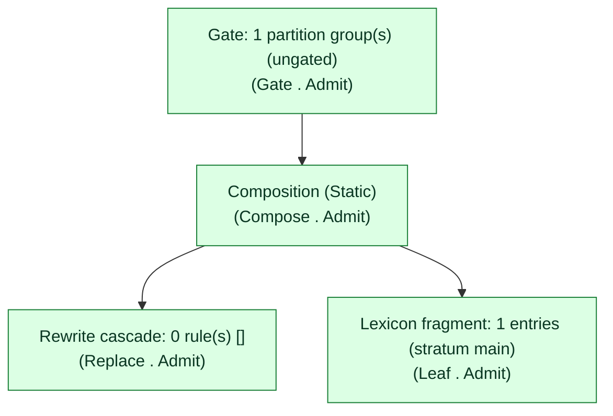

# PanGloss readiness report: MakeReportAdmitFixture

Policy `readiness-policy-v1` (report schema v1), device class: dev-workstation-v1 (Windows 11 x64, single-threaded `pangloss batch --threads 1`, release build -- the exact configuration docs/benchmark-matrix.md measured 2026-07-26 at commit 85f25dc, and the machine rust/tools/typology-speedup.sh runs on locally. NOT a mobile/embedded target device -- no such device has been benchmarked yet, and a certificate under this policy version must not be read as evidence about any other device class.)

## Verdict: CERTIFIED

This grammar is **CERTIFIED** under policy `readiness-policy-v1`: every declared threshold passed on the checks this report performed. See "What this report did NOT test" below for exactly what that excludes.

> CERTIFIED: every declared threshold passed under this policy version, on the checks this report performed. See `checks` for exactly what was and was not assessed.

## Capability

**Admit** -- the capability gate admits this grammar outright.

## Trust

**Proven** -- no ADR-0005 capability override was exercised.

## Checks

| Check | Outcome | Threshold | Calibration |
|---|---|---|---|
| Pack (artifact) size | PASS (12345 bytes) | 100000000 bytes | placeholder, un-calibrated |
| Lexicon scale | PASS (2000) | 1000 | placeholder, un-calibrated |
| Coverage (token-level analysis rate) | PASS (0.9500) | 0.9000 | placeholder, un-calibrated |
  - _Coverage is a token-level ANALYSIS RATE: the fraction of tokens receiving at least one analysis. A token may receive an INCORRECT analysis and still count -- this is not an accuracy or correctness measurement. Correctness is the conformance suite's job._
  - _Held-out status is an ATTESTATION, not a measurement: nothing in the artifact records what its author read while authoring, and PanGloss does not train. This property is UNVERIFIED beyond the named attestor's own claim._
| Latency p50 | PASS (0.500 ms) | 1.000 ms | measured |
| Latency p90 | PASS (2.000 ms) | 5.000 ms | measured |
| Latency p99 | PASS (10.000 ms) | 20.000 ms | measured |

## Coverage attestation

ATTESTED -- attestor=`synthetic-golden-attestor`, attested_on=`2026-07-27`, corpus=`synthetic-golden-corpus.txt` (sha256=`0000000000000000000000000000000000000000000000000000000000000000`), analysis_rate=0.9500. UNVERIFIED beyond the named attestor's own claim (nothing in the artifact records what its author read while authoring, and PanGloss does not train).

## Build time

0.500 ms (compiling the propose+confirm analyzer this report's latency numbers were measured against; informational only -- no threshold in the declared policy gates this figure).

## Latency methodology

Measured in-process via nanosecond `Instant`/`Duration` timing over a real `FomaAnalyzer`: 1 word(s), 7 timed samples/word after 1 discarded warmup call, this run's calibrated timer floor is 100ns. Word source: fixed synthetic golden fixture. p50/p90/p99 are the nearest-rank percentile over each word's own median duration.

## Compilation plan

4 node(s) emitted of 4 total (sibling-leaf collapse threshold=24, summarized=false), overall capability verdict from the SAME real evaluation this report's own "Capability" section names.

## What this report did NOT test

- correctness: NOT CERTIFIED HERE -- coverage (when assessed) is a token-level analysis RATE, never accuracy; correctness evidence comes from the synthetic conformance suite, not from this report.

## Pinned revisions (to re-derive this report)

- grammar: `synthetic-golden-fixture.xml` (sha256=`f53879f4f11b9bfd6685f06a398307a5d5b01d841e5f52b9c78adceedbfdb85e`)
- pack: built in-process for this report, not persisted to disk (sha256=`fixed-golden-sha`, package_fingerprint=`fixed-golden-fingerprint`)
- coverage corpus: `synthetic-golden-corpus.txt` (sha256=`0000000000000000000000000000000000000000000000000000000000000000`)
- `machine` submodule: 1 machine (heads/main)
- repo HEAD: `0000000000000000000000000000000000000000`
- this report: `report.md`

